# Fonos Group 13 - Android Audiobook Reader Documentation

## 1. Project Overview

`Fonos_Group13` is an Android audiobook reader prototype. The application is
presented to users as `Book Reader`, with `Lumina` used as a visible product
brand in the current interface. The app allows a reader to sign in, discover
published audiobooks, search by title or author, open a book-detail playlist,
choose chapters, play chapter audio, download chapter MP3 files for local
playback, manage downloaded audio, choose a default playback speed, track
listening progress, review or edit basic profile information, create
user-generated audiobook drafts, manage chapters in My Uploads, request or
retry AWS Polly generation, preview ready audio as the creator, publish
approved uploads, and toggle published uploads between Public and Private.

The core problem addressed by the app is the fragmentation of reading,
listening, and progress tracking. Instead of requiring separate tools for book
discovery, audio playback, and completion status, the application provides one
mobile flow for browsing, listening, resuming, and managing an audiobook
library.

The primary users are students and general readers who want a lightweight
Android app for audiobook listening. The current version is best classified as
an MVP/prototype for a university mobile development project. It focuses on the
main learning and listening workflow rather than advanced production features
such as subscriptions, recommendations, analytics, or multi-device offline sync.

The main value of the application is a simple authenticated audiobook
experience:

- Firebase Authentication provides account access.
- Cloud Firestore stores published books, chapter metadata, and user listening
  progress.
- Media3 `MediaSessionService` owns ExoPlayer for background playback,
  notification media controls, lock-screen controls, and reopening the current
  reader chapter from the playback notification.
- Internal app storage supports downloaded chapter MP3 files.
- SharedPreferences stores the user's default playback speed.
- The sibling `Fonos_Audiobook_Backend` service owns trusted user-generated
  audiobook writes, AWS Polly generation, S3 output metadata, publication, and
  visibility changes.
- Firebase Cloud Messaging supports best-effort generation completion or
  failure notifications for My Uploads.
- XML layouts provide a familiar Android interface for discovery, search,
  library, profile, audio preferences, login, registration, creator upload,
  chapter management, My Uploads, book detail, and reader screens.
- User-generated audiobook backend implementation details are documented in
  the sibling `Fonos_Audiobook_Backend/README.md`.

## 2. Scope of the Application

### In Scope

- User registration with email and password.
- User login, session detection, and logout.
- Display of published audiobooks from Cloud Firestore.
- Featured and regular audiobook presentation on the Discover screen.
- Search by audiobook title or author.
- Book detail playlist with cover art, summary actions, and chapter rows.
- Saving and unsaving published audiobooks into the authenticated user's
  library.
- Library filtering over saved audiobooks by Listening, Downloaded, and
  Finished using chapter progress and downloaded chapter state.
- Profile display-name editing.
- Reader screen with selected chapter content, duration, seek bar,
  previous/next chapter navigation, play/pause, playback speed, and chapter
  download controls.
- Audio preferences for the default playback speed.
- Audio playback from a chapter remote `audioUrl` or a downloaded local MP3
  file.
- Background audiobook playback through `PlaybackService`, a Media3
  `MediaSessionService` declared as a foreground media playback service.
- Media notification and lock-screen controls for play/pause, previous/next
  chapter navigation, and returning to the active reader chapter.
- Downloading remote chapter MP3 audio into app-private internal storage.
- Viewing downloaded chapter audio size and deleting downloaded chapter MP3
  files.
- Saving and restoring user listening progress per chapter.
- Profile display with email, display name fallback, completed book count, and
  listened-hours statistic.
- Creating and editing user-generated audiobook drafts from text.
- Adding and editing chapter drafts for user-generated audiobooks.
- Requesting and retrying generation for full audiobook drafts and individual
  chapter drafts through the authenticated backend.
- Viewing My Uploads with live book and chapter generation states, retry,
  preview, publish, visibility, delete, and cancel actions.
- Creator-only preview for ready-for-review unpublished uploads and individual
  ready chapters.
- Publishing ready-for-review uploads and making published uploads Public or
  Private.
- Generation completion/failure notifications through FCM when permissions and
  device token registration are available.

### Out of Scope

For the current reader MVP, the following areas are intentionally outside the
shipped feature set:

- Payment, subscription, or premium content access.
- Social sharing, playlists, and recommendations.
- Scheduled reminders and non-generation marketing notifications.
- Room, SQLite, or other structured catalog/progress caching.
- Full admin/moderation tools for creating, editing, or approving books inside
  the mobile app.
- Multi-language UI management beyond the currently present string resources.
- Full offline catalog browsing when Firestore is unavailable.

### Planned Future Capabilities

- Book-level ratings and short text reviews for published audiobooks.
- A future moderation workflow for user-created books before they become
  visible through `published=true`.

### Assumptions

- The app is an MVP/prototype and prioritizes core flows over production-scale
  infrastructure.
- Cloud Firestore is the source of truth for the catalog and progress metadata.
- Downloaded chapter MP3 files are stored only on the device where they were
  downloaded.
- Audio preference values are local to the device.
- User-generated audiobook generation requires the sibling
  `Fonos_Audiobook_Backend` service plus Firebase Admin credentials, AWS
  credentials, and an S3 bucket configured for the demo playback policy.
- A chapter is considered completed when the saved playback position reaches at
  least 95 percent of the chapter duration; a book is finished when all
  published chapters are completed.
- Firebase is configured through `app/google-services.json`; without this file,
  authentication and Firestore flows cannot operate normally.

### Constraints

- Platform: Android.
- Language and UI framework: Java with XML layouts.
- Architecture requirement: MVC.
- Minimum SDK: 24.
- Target SDK: 36.
- Compile SDK: Android release 36 with minor API level 1.
- Gradle Android plugin: 9.2.1.
- Java compatibility: Java 11.
- Network dependency: Firebase, the creator backend, FCM, and remote MP3 URLs
  require internet access.
- Playback lifecycle: `PlaybackService` owns ExoPlayer and the `MediaSession`;
  `ActivityReader` controls it through a Media3 `MediaController`.

## 3. Functional Requirements

| Requirement ID | Requirement Name | Description | Priority | Related Screen/Module |
|---|---|---|---|---|
| FR-01 | Launch routing | The app shall route authenticated users to Discover and unauthenticated users to Login. | High | `MainActivity`, `AuthRepository` |
| FR-02 | User login | The app shall allow users to sign in with a valid email and password. | High | `LoginActivity`, Firebase Auth |
| FR-03 | User registration | The app shall allow users to create an account with email, password, and password confirmation. | High | `RegisterActivity`, Firebase Auth |
| FR-04 | User logout | The app shall allow users to sign out and clear the navigation stack back to Login. | High | `ProfileActivity`, `AuthRepository` |
| FR-05 | Update display name | The app shall allow authenticated users to update their profile display name. | Medium | `ProfileActivity`, `AuthRepository` |
| FR-06 | Display published books | The app shall load books where `published` is true from Firestore and sort them by `order`. | High | `DiscoverActivity`, `BookRepository` |
| FR-07 | Open book detail | The app shall open a book-detail playlist for a selected book using the `book_id` intent extra. | High | Discover, Search, Library, `BookDetailActivity` |
| FR-08 | Search catalog | The app shall filter loaded books by title or author as the user types. | Medium | `SearchActivity` |
| FR-09 | Filter saved library | The app shall load saved audiobook IDs from `users/{uid}/savedBooks`, intersect them with currently published and visible books, and filter the result by listening, downloaded, and finished status using chapter-level progress and downloads. | Medium | `LibraryActivity`, `SavedBookRepository`, `ProgressRepository`, `DownloadedAudioRepository` |
| FR-10 | Play chapter audio | The app shall resolve playable chapter audio sources, build a Media3 chapter playlist, and play it through ExoPlayer owned by `PlaybackService`. | High | `ActivityReader`, `PlaybackService`, `AudioSourceResolver` |
| FR-11 | Control playback | The app shall support play/pause, seek bar control, previous/next chapter navigation, speed cycling, default speed preference, and notification media controls. | High | `ActivityReader`, `AudioPreferencesActivity`, `PlaybackService` |
| FR-12 | Save progress | The app shall save current chapter playback position, duration, completion state, and update timestamp. | High | `ProgressRepository`, Firestore |
| FR-13 | Restore progress | The app shall seek to the last saved position when a chapter is reopened. | High | `ActivityReader`, `PlaybackService`, `ProgressRepository` |
| FR-14 | Download audio | The app shall download a chapter MP3 from `audioUrl` and store it in `files/audiobooks`. | Medium | `DownloadedAudioRepository` |
| FR-15 | Manage downloaded audio | The app shall show downloaded chapter audio size and allow local chapter MP3 deletion. | Medium | `AudioPreferencesActivity`, `DownloadedAudioRepository` |
| FR-16 | Prefer local audio | The app shall prefer a downloaded local MP3 over the remote URL when both are available. | Medium | `AudioSourceResolver` |
| FR-17 | Display profile stats | The app shall display completed books and approximate listened hours aggregated from chapter progress. | Medium | `ProfileActivity`, `ProgressRepository` |
| FR-18 | Show empty/error states | The app shall show clear messages when books, search results, library rows, downloads, or audio sources are unavailable. | Medium | Discover, Search, Library, Reader, Audio Preferences |
| FR-19 | Continue playback in background | The app shall keep audio playing when the user leaves `ActivityReader`, expose system media controls, and reopen the active reader chapter from the media notification when available. | High | `PlaybackService`, Android Manifest |
| FR-20 | Save published audiobooks | The app shall let signed-in users save or unsave a published audiobook from Book Detail and use saved records as the Library source. | Medium | `BookDetailActivity`, `LibraryActivity`, `SavedBookRepository` |
| FR-21 | Create and edit user-generated audiobook drafts | The app shall let signed-in users enter or edit title, author, optional cover URL, first-chapter text, and Patrick/Ruth voice choice for a user-generated audiobook. | Medium | `CreateAudiobookActivity`, `CreatorAudiobookRepository`, creator backend |
| FR-22 | Manage upload chapters | The app shall let creators add chapter drafts, edit draft chapters, request or retry chapter generation, preview ready chapters, and delete or cancel non-published chapters. | Medium | `ManageChapterActivity`, `MyUploadsActivity`, `CreatorAudiobookRepository` |
| FR-23 | View creator uploads live | The app shall list the signed-in user's generated audiobook uploads and observe book and chapter changes in Firestore for `draft`, `pending_generation`, `failed`, `ready_for_review`, `published`, `rejected`, and `deleted` states. | Medium | `MyUploadsActivity`, `UserGeneratedAudiobook`, `UserGeneratedChapter` |
| FR-24 | Creator-only preview and publish | The app shall allow the creator to open and play ready-for-review unpublished audiobooks, publish ready uploads, and keep unpublished content out of Discover/Search. | High | `MyUploadsActivity`, `BookRepository`, `BookDetailActivity`, `ActivityReader`, creator backend |
| FR-25 | Manage creator visibility | The app shall let creators make a published user-generated audiobook private or public without deleting it from My Uploads. | Medium | `MyUploadsActivity`, `BookRepository`, creator backend |
| FR-26 | Generation notifications | The app shall register FCM device tokens for signed-in creators and show generation completion/failure notifications that reopen My Uploads. | Medium | `GenerationNotificationSetup`, `GenerationNotificationMessagingService`, `UploadNotificationTokenRepository` |

Book-level reviews remain outside the current Android client feature set. The
backend handoff is documented in the workspace-level
`USER_GENERATED_AUDIOBOOK_BACKEND_HANDOFF.md`.

## 4. Non-Functional Requirements

| Category | Requirement |
|---|---|
| Usability | The app should provide direct bottom navigation between Discover, Search, Library, and Profile. Form errors should appear close to the relevant input field. |
| Performance | Firestore reads should load a small MVP catalog quickly. Audio playback runs in `PlaybackService`, while MP3 downloads already run on a background thread. |
| Reliability | Missing Firebase configuration, missing book IDs, missing Firestore documents, empty search results, and missing audio URLs should produce controlled UI feedback instead of crashes. |
| Security | Authentication should be handled by Firebase Auth. User chapter progress, saved-library entries, and upload notification tokens should be stored under the authenticated user's `users/{uid}` document. The creator backend derives ownership from the Firebase ID token and ignores client-supplied identity fields. Downloaded files should remain in app-private internal storage. |
| Maintainability | Models, repositories, and UI resources should remain separated. Activities currently coordinate controller logic and should avoid growing unrelated responsibilities. |
| Compatibility | The app targets modern Android while supporting minSdk 24. Edge-to-edge handling is implemented with AndroidX insets APIs. |
| Offline Support | Downloaded chapter MP3 playback is supported for files already saved locally. Catalog and progress features still depend on Firebase connectivity. |

## 5. System Architecture - MVC

The project uses a practical Android MVC structure. The requested MVC pattern is
mapped to the existing package layout as follows:

- Model: `model/*` and `data/*`. These classes represent domain objects,
  Firebase access, saved-library metadata, chapter progress persistence,
  creator backend access, upload notification tokens, and local audio download
  storage.
- View: XML layouts and UI resources under `app/src/main/res`, including
  `activity_login.xml`, `activity_register.xml`, `activity_discover.xml`,
  `activity_search.xml`, `activity_library.xml`, `activity_profile.xml`,
  `activity_book_detail.xml`, `activity_audio_preferences.xml`,
  `activity_create_audiobook.xml`, `activity_manage_chapter.xml`,
  `activity_my_uploads.xml`, `dialog_edit_display_name.xml`, and
  `activity_reader.xml`.
- Controller: Activities such as `LoginActivity`, `DiscoverActivity`,
  `LibraryActivity`, `BookDetailActivity`, `ProfileActivity`,
  `CreateAudiobookActivity`, `ManageChapterActivity`, `MyUploadsActivity`,
  `AudioPreferencesActivity`, and `ActivityReader`. They bind XML views,
  validate user input, handle clicks, call repositories or backend clients,
  and update the UI.

MVC is appropriate for this app because the prototype is Activity-centered,
uses XML views, and has a small number of workflows. The pattern is easy for a
student development team to understand and aligns with the current codebase
without introducing ViewModel, UseCase, or dependency-injection layers.

The main tradeoff is that Activities can become large because they handle both
controller logic and Android lifecycle work. `BookDetailActivity` now
coordinates the playlist-style chapter selection surface, creator preview
publishing, and saved-library actions, while `ActivityReader` coordinates
selected-chapter playback controls, MediaController connection, progress
persistence, and chapter download actions. `MyUploadsActivity` owns a larger
creator-management surface because it observes both upload documents and their
chapter subcollections. Playback ownership has been moved into
`PlaybackService`, which keeps ExoPlayer outside the Activity lifecycle. For
the MVP this is acceptable, but a larger version should consider moving reader,
playlist, and creator upload UI state into a ViewModel or dedicated controller.

```mermaid
flowchart TB
    subgraph View["View Layer - XML and Resources"]
        Layouts["XML layouts: login, register, discover, search, library, profile, book detail, create audiobook, manage chapter, My Uploads, audio preferences, reader"]
        Resources["Drawables, colors, themes, strings, icons"]
    end

    subgraph Controller["Controller Layer - Activities"]
        Main["MainActivity"]
        AuthScreens["LoginActivity and RegisterActivity"]
        BrowseScreens["DiscoverActivity, SearchActivity, LibraryActivity, BookDetailActivity, ProfileActivity, AudioPreferencesActivity"]
        CreatorScreens["CreateAudiobookActivity, ManageChapterActivity, MyUploadsActivity"]
        Reader["ActivityReader"]
    end

    subgraph Model["Model and Data Layer"]
        BookModel["Book and BookChapter"]
        UploadModel["UserGeneratedAudiobook, UserGeneratedChapter, AudiobookGenerationStatus"]
        ProgressModel["UserProgress"]
        AuthRepo["AuthRepository"]
        BookRepo["BookRepository"]
        SavedRepo["SavedBookRepository"]
        ProgressRepo["ProgressRepository"]
        DownloadRepo["DownloadedAudioRepository"]
        CreatorRepo["CreatorAudiobookRepository"]
        CreatorApi["CreatorApiClient and CreatorApiContract"]
        NotificationTokenRepo["UploadNotificationTokenRepository"]
        AudioPrefs["AudioPreferences"]
        Resolver["AudioSourceResolver"]
        FirebaseConfig["FirebaseConfig"]
    end

    subgraph External["External and Platform Services"]
        FirebaseAuth["Firebase Authentication"]
        Firestore["Cloud Firestore"]
        RemoteAudio["Remote chapter MP3 audioUrl"]
        InternalFiles["Internal files/audiobooks/*__*.mp3"]
        LocalPrefs["SharedPreferences audio_preferences"]
        PlaybackService["PlaybackService MediaSessionService"]
        CreatorBackend["Fonos_Audiobook_Backend Express API"]
        FirebaseMessaging["Firebase Cloud Messaging"]
        S3Audio["Generated S3 audioUrl"]
        ExoPlayer["Media3 ExoPlayer"]
        MediaNotification["Media notification and lock-screen controls"]
        UploadNotification["Upload generation status notification"]
        Glide["Glide image loading"]
    end

    Layouts --> Main
    Layouts --> AuthScreens
    Layouts --> BrowseScreens
    Layouts --> CreatorScreens
    Layouts --> Reader
    Resources --> Layouts

    Main --> AuthRepo
    AuthScreens --> AuthRepo
    BrowseScreens --> BookRepo
    BrowseScreens --> SavedRepo
    BrowseScreens --> ProgressRepo
    BrowseScreens --> DownloadRepo
    BrowseScreens --> AudioPrefs
    CreatorScreens --> CreatorRepo
    CreatorScreens --> NotificationTokenRepo
    Reader --> BookRepo
    Reader --> ProgressRepo
    Reader --> DownloadRepo
    Reader --> Resolver
    Reader --> AudioPrefs
    Reader --> PlaybackService

    AuthRepo --> FirebaseAuth
    AuthRepo --> Firestore
    BookRepo --> Firestore
    SavedRepo --> FirebaseAuth
    SavedRepo --> Firestore
    CreatorRepo --> Firestore
    CreatorRepo --> CreatorApi
    CreatorApi --> FirebaseAuth
    CreatorApi --> CreatorBackend
    CreatorBackend --> Firestore
    CreatorBackend --> S3Audio
    CreatorBackend --> FirebaseMessaging
    NotificationTokenRepo --> FirebaseAuth
    NotificationTokenRepo --> Firestore
    NotificationTokenRepo --> FirebaseMessaging
    ProgressRepo --> FirebaseAuth
    ProgressRepo --> Firestore
    PlaybackService --> ExoPlayer
    PlaybackService --> ProgressRepo
    PlaybackService --> MediaNotification
    MediaNotification --> Reader
    FirebaseMessaging --> UploadNotification
    UploadNotification --> CreatorScreens
    DownloadRepo --> RemoteAudio
    DownloadRepo --> InternalFiles
    AudioPrefs --> LocalPrefs
    Resolver --> DownloadRepo
    Resolver --> RemoteAudio
    Resolver --> InternalFiles
    BookRepo --> BookModel
    CreatorRepo --> UploadModel
    ProgressRepo --> ProgressModel
    BookModel --> Glide
```

Main playback flow:

1. The user selects a book from Discover, Search, or Library.
2. The controller opens `BookDetailActivity` with `EXTRA_BOOK_ID`.
3. `BookDetailActivity` requests the book and `books/{bookId}/chapters`
   documents from `BookRepository`.
4. The user selects or resumes a chapter; `ActivityReader` opens with
   `EXTRA_BOOK_ID` and `EXTRA_CHAPTER_ID`.
5. `AudioSourceResolver` checks whether each playable chapter has a local MP3
   before using the chapter `audioUrl`.
6. `ActivityReader` loads saved progress for the selected chapter before
   replacing the player playlist.
7. `ActivityReader` connects to `PlaybackService` with a Media3
   `MediaController` and sends a chapter playlist of `MediaItem` objects with
   book/chapter metadata, artwork, and source URIs.
8. `ActivityReader` reads the default playback speed from `AudioPreferences`
   and applies it to the controller.
9. `PlaybackService` prepares and plays ExoPlayer through a `MediaSession`.
10. `ProgressRepository` saves progress using the chapter progress document ID
    on pause, end, stop, service destruction, and chapter transitions.
11. The media notification exposes play/pause plus previous/next chapter
    controls and points back to the active `ActivityReader` chapter.

## 6. Project Folder Structure

The current Android project structure already supports a small MVC prototype:

```text
app/
  src/main/
    AndroidManifest.xml
    java/com/example/fonos_group13/
      MainActivity.java
      LoginActivity.java
      RegisterActivity.java
      DiscoverActivity.java
      SearchActivity.java
      LibraryActivity.java
      BookDetailActivity.java
      ProfileActivity.java
      CreateAudiobookActivity.java
      ManageChapterActivity.java
      MyUploadsActivity.java
      AudioPreferencesActivity.java
      ActivityReader.java
      audio/
        AudioPreferences.java
        AudioSourceResolver.java
        PlaybackService.java
      data/
        AuthRepository.java
        BookRepository.java
        BookAccessMode.java
        BookAccessPolicy.java
        CreatorAudiobookRepository.java
        CreatorApiClient.java
        CreatorApiContract.java
        CreatorBackendDataSource.java
        ProgressRepository.java
        DownloadedAudioRepository.java
        SavedBookRepository.java
        UploadNotificationTokenRepository.java
        FirebaseConfig.java
        RepositoryCallback.java
      model/
        AudiobookGenerationStatus.java
        Book.java
        BookChapter.java
        CreateAudiobookDraftInput.java
        CreateChapterDraftInput.java
        CreatorVoiceOption.java
        EditableAudiobookDraft.java
        EditableChapterDraft.java
        UserGeneratedAudiobook.java
        UserGeneratedChapter.java
        UserProgress.java
      notifications/
        GenerationNotificationHelper.java
        GenerationNotificationMessagingService.java
        GenerationNotificationSetup.java
      ui/
        BookCoverLoader.java
    res/
      layout/
        activity_audio_preferences.xml
        activity_book_detail.xml
        activity_create_audiobook.xml
        activity_manage_chapter.xml
        activity_my_uploads.xml
        dialog_edit_display_name.xml
      layout-land/
      layout-port/
      layout-vi/
      values/
      values-vi/
      drawable/
      mipmap-*/
```

| Folder/File | MVC Role | Purpose |
|---|---|---|
| `java/com/example/fonos_group13/*.java` | Controller | Activity classes handle screen lifecycle, event handling, navigation, validation, and repository calls. |
| `model/` | Model | `Book`, `BookChapter`, `UserProgress`, creator draft inputs, generated-upload models, and `AudiobookGenerationStatus` represent application data. |
| `data/` | Model/Data access | Repository and backend client classes communicate with Firebase, chapter subcollections, saved-library documents, progress documents, notification token documents, local files, and the creator backend. |
| `audio/` | Playback/helper | Stores audio preferences, resolves the correct playback URI from local downloads or remote URLs, and hosts the Media3 playback service. |
| `notifications/` | Platform/helper | Registers FCM tokens, requests notification permission, receives generation messages, and opens My Uploads from status notifications. |
| `ui/` | View helper | `BookCoverLoader` centralizes cover image loading logic. |
| `res/layout*` | View | XML screen definitions for portrait, landscape, and localized variants. |
| `res/drawable` | View | Icons, cards, progress backgrounds, buttons, and placeholders. |
| `AndroidManifest.xml` | Platform configuration | Declares Activities, `PlaybackService`, internet permission, and foreground media playback permissions. |

If the project grows, a more explicit MVC package layout could move Activities
into `controller/` or `view/`, but the current structure should not be renamed
unless the team is ready to update package references and Android declarations.

## 7. Use Case Diagram

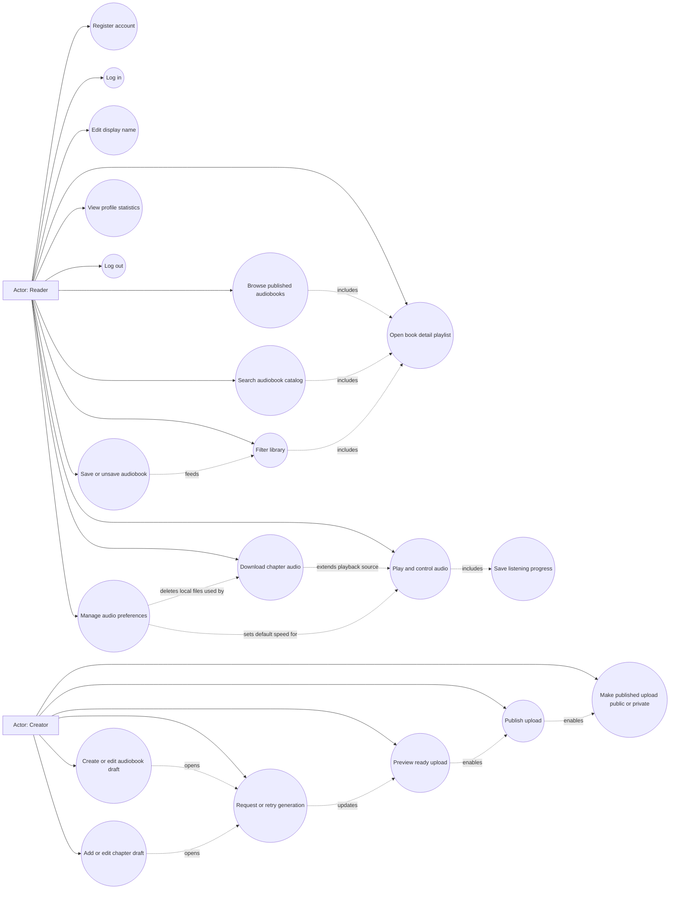

Use case explanations:

- Register account: a new reader creates a Firebase Auth account and profile
  document.
- Log in: an existing reader authenticates with email and password.
- Browse published audiobooks: the reader views Firestore books where
  `published` is true.
- Search audiobook catalog: the reader filters loaded books by title or author.
- Open book detail playlist: the reader opens `BookDetailActivity` for a
  selected book, then chooses or resumes a chapter.
- Play and control audio: the reader plays, pauses, seeks within a chapter,
  moves to the previous or next chapter, and changes speed.
- Save listening progress: the app stores position, duration, completion, and
  timestamp.
- Download chapter audio: the reader saves a selected chapter MP3 into
  app-private storage.
- Save or unsave audiobook: the reader adds or removes a published audiobook
  from `users/{uid}/savedBooks`.
- Filter library: the reader views saved books that are listening,
  downloaded, or finished.
- Edit display name: the reader updates the Firebase profile display name from
  Profile.
- Manage audio preferences: the reader chooses the default playback speed and
  deletes downloaded chapter MP3 files.
- View profile statistics: the reader checks email, completed count, and
  listened hours.
- Log out: the reader ends the Firebase session and returns to Login.
- Create or edit audiobook draft: the creator enters title, author, optional
  cover URL, first-chapter text, and Patrick/Ruth voice choice.
- Add or edit chapter draft: the creator manages follow-up chapter text and
  voice choice for an existing upload.
- Request or retry generation: the creator queues book-level or chapter-level
  generation through the authenticated backend.
- Preview ready upload: the creator opens a ready-for-review audiobook or
  individual ready chapter without exposing it in Discover/Search.
- Publish upload: the creator publishes ready-for-review generated audio.
- Make published upload public or private: the creator hides or restores a
  published user-generated audiobook from the public catalog.

## 8. Activity Diagram / User Flow

### User Flow 1: Open and Play an Audiobook

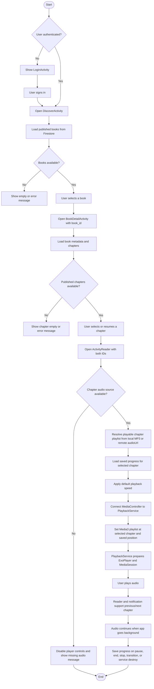

### User Flow 2: Manage Audio Preferences

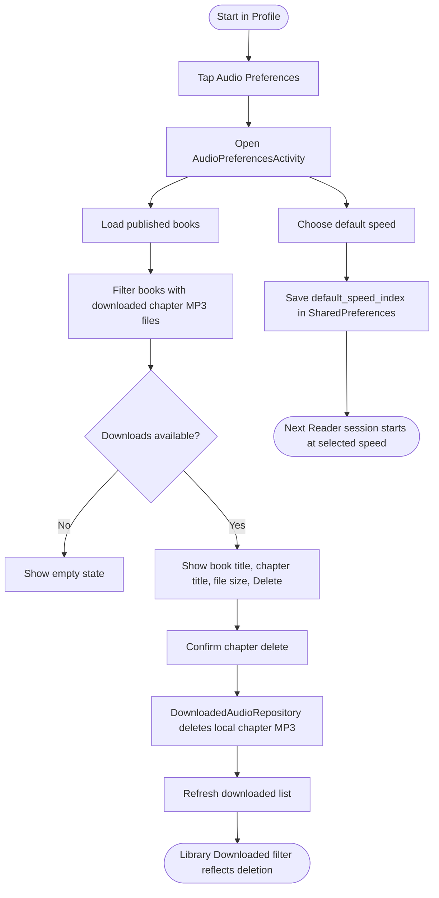

### User Flow 3: Download Audio for Local Playback

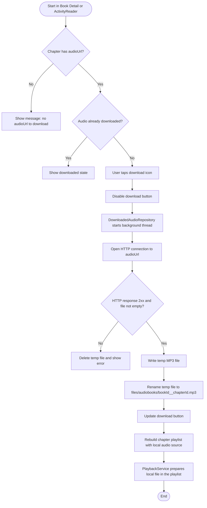

### User Flow 4: Create, Generate, and Publish a User Upload

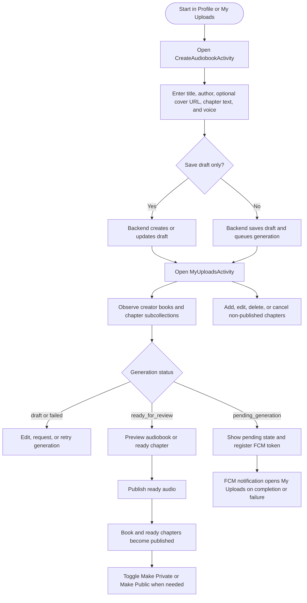

## 9. Sequence Diagrams By User Flow

Each sequence below matches one user flow from the activity diagrams above.

### Sequence 1: Open and Play an Audiobook

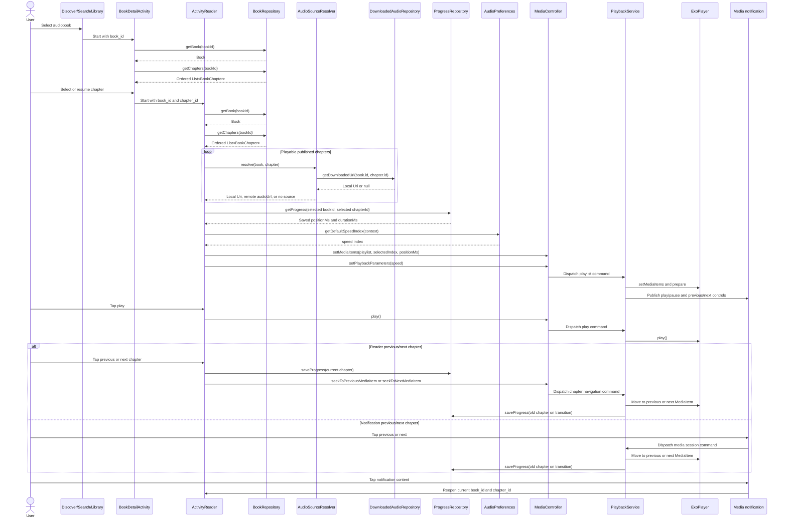

### Sequence 2: Manage Audio Preferences

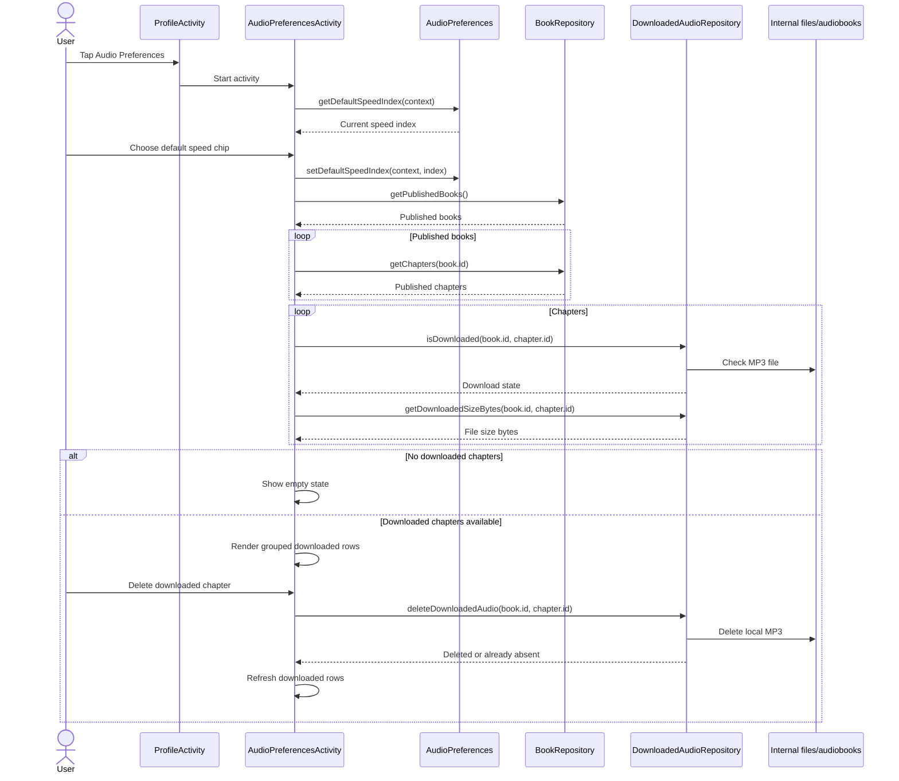

### Sequence 3: Download Audio for Local Playback

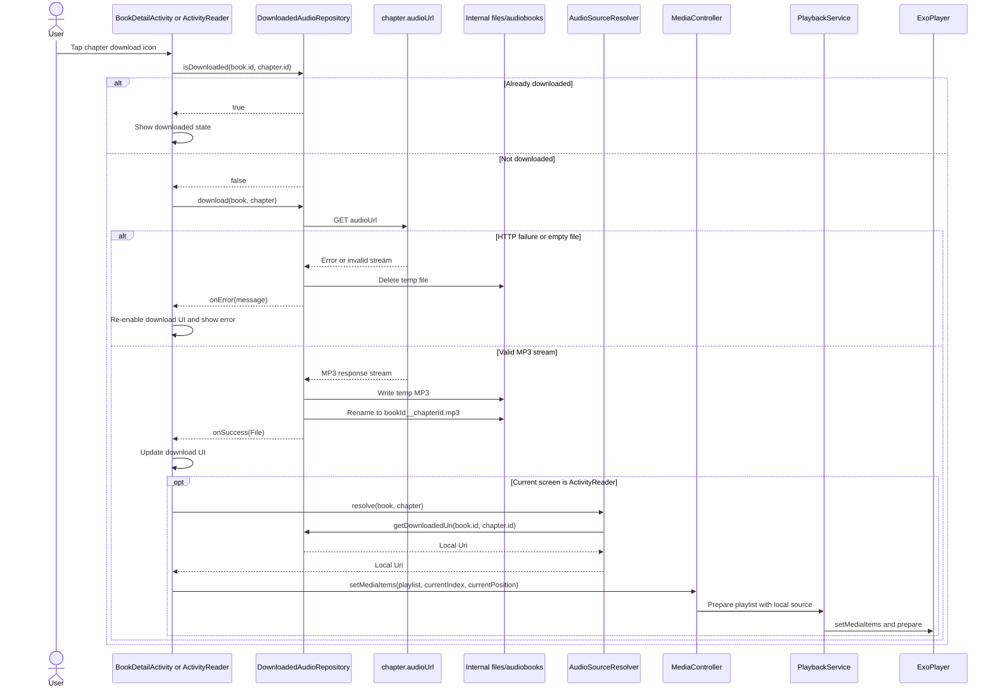

## 10. Class Diagram

```mermaid
classDiagram
    class MainActivity {
        +onCreate(Bundle)
    }

    class LoginActivity {
        -AuthRepository authRepository
        -EditText inputEmail
        -EditText inputPassword
        -Button btnLogin
        -signIn()
        -setLoading(boolean)
        -openDiscover()
    }

    class RegisterActivity {
        -AuthRepository authRepository
        -EditText inputEmail
        -EditText inputPassword
        -EditText inputConfirmPassword
        -register()
        -setLoading(boolean)
    }

    class DiscoverActivity {
        -BookRepository bookRepository
        -loadBooks()
        -bindBooks(List~Book~)
        -openBookDetail(Book)
    }

    class SearchActivity {
        -List~Book~ allBooks
        -BookRepository bookRepository
        -setupSearch()
        -filterBooks(String) List~Book~
        -openBookDetail(Book)
    }

    class LibraryActivity {
        -BookRepository bookRepository
        -ProgressRepository progressRepository
        -DownloadedAudioRepository downloadedAudioRepository
        -Map chaptersByBookId
        -Map progressByChapterKey
        -loadBooks()
        -filterBooks() List~Book~
        -openBookDetail(Book)
    }

    class BookDetailActivity {
        +EXTRA_BOOK_ID String
        -BookRepository bookRepository
        -ProgressRepository progressRepository
        -DownloadedAudioRepository downloadedAudioRepository
        -Book currentBook
        -List~BookChapter~ chapters
        -loadBook(String)
        -loadChapters(String)
        -openReader(BookChapter, boolean)
        -downloadChapter(BookChapter)
    }

    class ProfileActivity {
        -AuthRepository authRepository
        -BookRepository bookRepository
        -ProgressRepository progressRepository
        -bindProfile()
        -setupProfileActions()
        -showDisplayNameDialog()
        -loadStats()
        -updateStats(int, long)
    }

    class AudioPreferencesActivity {
        -BookRepository bookRepository
        -DownloadedAudioRepository downloadedAudioRepository
        -setupSpeedOptions()
        -loadDownloads()
        -bindDownloadedChapters()
        -deleteDownload(Book, BookChapter)
    }

    class ActivityReader {
        +EXTRA_BOOK_ID String
        +EXTRA_CHAPTER_ID String
        -Book currentBook
        -BookChapter currentChapter
        -MediaController mediaController
        -ListenableFuture controllerFuture
        -BookRepository bookRepository
        -ProgressRepository progressRepository
        -DownloadedAudioRepository downloadedAudioRepository
        -AudioSourceResolver audioSourceResolver
        -int speedIndex
        -connectController()
        -loadBookAndChapter(String, String)
        -prepareAudio(Book, BookChapter)
        -togglePlayback()
        -downloadCurrentBook()
        -saveProgress()
        -releaseController()
    }

    class CreateAudiobookActivity {
        +EXTRA_EDIT_BOOK_ID String
        -CreatorAudiobookRepository repository
        -GenerationNotificationSetup notificationSetup
        -saveDraft(boolean requestGeneration)
        -loadDraftForEdit()
    }

    class ManageChapterActivity {
        +EXTRA_BOOK_ID String
        +EXTRA_CHAPTER_ID String
        -CreatorAudiobookRepository repository
        -GenerationNotificationSetup notificationSetup
        -saveDraft(boolean requestGeneration)
        -loadDraftForEdit()
    }

    class MyUploadsActivity {
        -CreatorAudiobookRepository repository
        -GenerationNotificationSetup notificationSetup
        -Map chaptersByBookId
        -startObservingUploads()
        -requestGeneration(UserGeneratedAudiobook)
        -requestChapterGeneration(UserGeneratedAudiobook, UserGeneratedChapter)
        -publishUploadUpdate(UserGeneratedAudiobook)
        -setAudiobookVisibility(UserGeneratedAudiobook, boolean)
        -deleteChapter(UserGeneratedAudiobook, UserGeneratedChapter)
    }

    class PlaybackService {
        -ExoPlayer player
        -MediaSession mediaSession
        -ProgressRepository progressRepository
        +onCreate()
        +onGetSession(ControllerInfo)
        +onDestroy()
        -createSessionActivity() PendingIntent
        -updateSessionActivity()
        -saveCurrentProgress()
    }

    class Book {
        -String id
        -String title
        -String author
        -String coverUrl
        -String isbn
        -String languageCode
        -String voiceGender
        -boolean featured
        -boolean published
        -int order
        +fromDocument(DocumentSnapshot) Book
    }

    class BookChapter {
        -String id
        -String bookId
        -String title
        -String chapterTitle
        -String contentSample
        -String audioUrl
        -String audioStoragePath
        -long durationSec
        -boolean published
        -int order
        +fromDocument(String, DocumentSnapshot) BookChapter
        +fromLegacyBook(Book) BookChapter
    }

    class UserProgress {
        -String bookId
        -String chapterId
        -long positionMs
        -long durationMs
        -boolean completed
        +empty(String) UserProgress
        +empty(String, String) UserProgress
        +fromDocument(String, DocumentSnapshot) UserProgress
    }

    class UserGeneratedAudiobook {
        -String id
        -String title
        -AudiobookGenerationStatus generationStatus
        -String activeChapterId
        -boolean published
        -boolean hiddenByCreator
        +fromDocument(DocumentSnapshot) UserGeneratedAudiobook
    }

    class UserGeneratedChapter {
        -String id
        -String title
        -AudiobookGenerationStatus generationStatus
        -boolean published
        -boolean hasAudio
        +fromDocument(String, DocumentSnapshot) UserGeneratedChapter
        +canEdit() boolean
        +canRequestGeneration() boolean
        +canPreview() boolean
        +canDelete() boolean
    }

    class AudiobookGenerationStatus {
        <<enum>>
        DRAFT
        PENDING_GENERATION
        FAILED
        READY_FOR_REVIEW
        PUBLISHED
        REJECTED
        DELETED
    }

    class AuthRepository {
        -boolean configured
        -FirebaseAuth auth
        -FirebaseFirestore firestore
        +getCurrentUser() FirebaseUser
        +signIn(String, String, RepositoryCallback)
        +register(String, String, RepositoryCallback)
        +updateDisplayName(String, RepositoryCallback)
        +signOut()
        +friendlyError(Exception) String
    }

    class BookRepository {
        -boolean configured
        -FirebaseFirestore firestore
        +getPublishedBooks(RepositoryCallback)
        +getBook(String, RepositoryCallback)
        +getChapters(String, RepositoryCallback)
    }

    class SavedBookRepository {
        +isSaved(String, RepositoryCallback)
        +saveBook(String, RepositoryCallback)
        +unsaveBook(String, RepositoryCallback)
        +getSavedBookIds(RepositoryCallback)
    }

    class CreatorAudiobookRepository {
        -CreatorBackendDataSource backendApi
        +createDraft(CreateAudiobookDraftInput, RepositoryCallback)
        +updateDraft(String, CreateAudiobookDraftInput, RepositoryCallback)
        +createChapterDraft(String, CreateChapterDraftInput, RepositoryCallback)
        +updateChapterDraft(String, String, CreateChapterDraftInput, RepositoryCallback)
        +requestGeneration(String, RepositoryCallback)
        +requestChapterGeneration(String, String, RepositoryCallback)
        +publishAudiobook(String, RepositoryCallback)
        +setAudiobookVisibility(String, boolean, RepositoryCallback)
        +deleteChapter(String, String, RepositoryCallback)
        +observeMyUploads(RepositoryCallback)
        +observeUploadChapters(String, RepositoryCallback)
    }

    class CreatorApiClient {
        -String baseUrl
        -FirebaseAuth auth
        +createDraft(CreateAudiobookDraftInput, RepositoryCallback)
        +requestGeneration(String, RepositoryCallback)
        +requestChapterGeneration(String, String, RepositoryCallback)
        +publishAudiobook(String, RepositoryCallback)
        +setAudiobookVisibility(String, boolean, RepositoryCallback)
        +deleteChapter(String, String, RepositoryCallback)
    }

    class UploadNotificationTokenRepository {
        +registerCurrentDevice(RepositoryCallback)
        +saveToken(String, RepositoryCallback)
        +documentIdForToken(String) String
    }

    class GenerationNotificationSetup {
        +ensureReady()
    }

    class GenerationNotificationMessagingService {
        +onMessageReceived(RemoteMessage)
        +onNewToken(String)
    }

    class ProgressRepository {
        -boolean configured
        -FirebaseAuth auth
        -FirebaseFirestore firestore
        +getProgress(String, RepositoryCallback)
        +getProgress(String, String, RepositoryCallback)
        +saveProgress(String, long, long)
        +saveProgress(String, String, long, long)
    }

    class DownloadedAudioRepository {
        -File audioDir
        +isDownloaded(String) boolean
        +isDownloaded(String, String) boolean
        +getDownloadedUri(String) Uri
        +getDownloadedUri(String, String) Uri
        +getDownloadedSizeBytes(String) long
        +getDownloadedSizeBytes(String, String) long
        +deleteDownloadedAudio(String) boolean
        +deleteDownloadedAudio(String, String) boolean
        +download(Book, RepositoryCallback)
        +download(Book, BookChapter, RepositoryCallback)
    }

    class AudioPreferences {
        +PLAYBACK_SPEEDS float[]
        +getDefaultSpeedIndex(Context) int
        +setDefaultSpeedIndex(Context, int)
        +getSpeedAt(int) float
        +formatSpeed(int) String
    }

    class AudioSourceResolver {
        -DownloadedAudioRepository downloadedAudioRepository
        +resolve(Book) Uri
        +resolve(Book, BookChapter) Uri
    }

    class RepositoryCallback~T~ {
        <<interface>>
        +onSuccess(T)
        +onError(Exception)
    }

    class BookCoverLoader {
        +findCoverView(View, int) ImageView
        +load(ImageView, Book)
    }

    MainActivity --> AuthRepository
    LoginActivity --> AuthRepository
    RegisterActivity --> AuthRepository
    DiscoverActivity --> BookRepository
    SearchActivity --> BookRepository
    LibraryActivity --> BookRepository
    LibraryActivity --> SavedBookRepository
    LibraryActivity --> ProgressRepository
    LibraryActivity --> DownloadedAudioRepository
    BookDetailActivity --> BookRepository
    BookDetailActivity --> SavedBookRepository
    BookDetailActivity --> CreatorAudiobookRepository
    BookDetailActivity --> ProgressRepository
    BookDetailActivity --> DownloadedAudioRepository
    ProfileActivity --> AuthRepository
    ProfileActivity --> BookRepository
    ProfileActivity --> ProgressRepository
    ProfileActivity --> AudioPreferencesActivity
    AudioPreferencesActivity --> AudioPreferences
    AudioPreferencesActivity --> BookRepository
    AudioPreferencesActivity --> DownloadedAudioRepository
    CreateAudiobookActivity --> CreatorAudiobookRepository
    CreateAudiobookActivity --> GenerationNotificationSetup
    ManageChapterActivity --> CreatorAudiobookRepository
    ManageChapterActivity --> GenerationNotificationSetup
    MyUploadsActivity --> CreatorAudiobookRepository
    MyUploadsActivity --> GenerationNotificationSetup
    ActivityReader --> BookRepository
    ActivityReader --> ProgressRepository
    ActivityReader --> DownloadedAudioRepository
    ActivityReader --> AudioPreferences
    ActivityReader --> AudioSourceResolver
    ActivityReader --> PlaybackService
    PlaybackService --> ProgressRepository
    BookRepository --> Book
    BookRepository --> BookChapter
    CreatorAudiobookRepository --> CreatorApiClient
    CreatorAudiobookRepository --> UserGeneratedAudiobook
    CreatorAudiobookRepository --> UserGeneratedChapter
    UserGeneratedAudiobook --> AudiobookGenerationStatus
    UserGeneratedChapter --> AudiobookGenerationStatus
    GenerationNotificationSetup --> UploadNotificationTokenRepository
    GenerationNotificationMessagingService --> UploadNotificationTokenRepository
    ProgressRepository --> UserProgress
    AudioSourceResolver --> DownloadedAudioRepository
    DownloadedAudioRepository --> Book
    DownloadedAudioRepository --> BookChapter
    BookCoverLoader --> Book
```

Class roles:

- Activities are MVC controllers and screen lifecycle owners.
- `PlaybackService` owns ExoPlayer and the Media3 `MediaSession` for
  background playback.
- `Book`, `BookChapter`, `UserProgress`, `UserGeneratedAudiobook`,
  `UserGeneratedChapter`, and `AudiobookGenerationStatus` are model objects.
- Repositories provide Firebase, backend API, notification token, saved
  library, progress, and local storage access.
- `CreatorApiClient` and `CreatorApiContract` keep authenticated backend I/O
  and JSON payload parsing outside Activities.
- `AudioPreferences` wraps SharedPreferences for the default playback speed.
- `AudioSourceResolver` selects the best playback source.
- `BookCoverLoader` keeps cover-loading UI logic reusable.
- `RepositoryCallback<T>` standardizes asynchronous success and error handling.

## 11. Data Design

The app uses Cloud Firestore for structured user and catalog data, plus internal
app storage for downloaded MP3 files.

### Firestore Collection: `books`

| Field | Data Type | Description | Constraints/Default |
|---|---|---|---|
| Document ID | String | Unique book identifier used as `book_id`. | Required |
| `title` | String | Book title. | Defaults to `Untitled` if missing |
| `author` | String | Book author. | Defaults to `Unknown author` if missing |
| `coverUrl` | String | Primary cover image URL. | Optional |
| `coverImageUrl` | String | Alternative cover image URL. | Optional fallback |
| `imageUrl` | String | Alternative cover image URL. | Optional fallback |
| `thumbnailUrl` | String | Alternative cover image URL. | Optional fallback |
| `isbn` | String | ISBN used to generate an Open Library cover URL if no cover URL exists. | Optional |
| `chapterTitle` | String | Legacy chapter heading used only when no `chapters` subcollection exists. | Defaults to `Chapter 1` |
| `contentSample` | String | Legacy reader text used only when no `chapters` subcollection exists. | Defaults to empty string |
| `audioUrl` | String | Legacy remote MP3 URL used only when no `chapters` subcollection exists. | Optional fallback |
| `audioStoragePath` | String | Legacy storage path metadata. | Optional |
| `durationSec` | Number | Legacy expected duration in seconds. | Defaults to `0` |
| `languageCode` | String | Audio language code. | Defaults to `en-US` |
| `voiceGender` | String | Voice metadata. | Defaults to `female` |
| `featured` | Boolean | Whether the book appears in the featured group. | Defaults to `false` |
| `published` | Boolean | Whether the book is visible in the app. | Only `true` books are loaded |
| `order` | Number | Sort order for display. | Defaults to `0` |

User-generated audiobook documents include `creatorUid`, `sourceType`,
`generationStatus`, `createdByUser`, `reviewStatus`, `activeChapterId`,
`hiddenByCreator`, `generationError`, `pollyVoiceId`, `createdAt`, and
`updatedAt`. Generation status values used by the Android model are `draft`,
`pending_generation`, `failed`, `ready_for_review`, `published`, `rejected`,
and `deleted`. Public catalog queries include only `published=true` books that
are not hidden or archived by the creator. Future rating fields may include
`ratingAverage` and `ratingCount`.

### Firestore Subcollection: `books/{bookId}/chapters`

| Field | Data Type | Description | Constraints/Default |
|---|---|---|---|
| Document ID | String | Unique chapter identifier used as `chapter_id`. | Required |
| `title` | String | Chapter display title. | Defaults to `Chapter {order + 1}` |
| `chapterTitle` | String | Alternative chapter title field. | Optional fallback |
| `contentSample` | String | Text displayed in the reader for this chapter. | Defaults to empty string |
| `audioUrl` | String | Remote MP3 URL used for streaming and download. | Optional but required for playback/download |
| `url` | String | Alternative remote audio URL field. | Optional fallback |
| `audioStoragePath` | String | Optional storage path metadata. | Optional |
| `durationSec` | Number | Expected chapter duration in seconds. | Defaults to `0` |
| `order` | Number | Chapter sort order. | Must be a Firestore number, not a quoted string |
| `published` | Boolean | Whether this chapter should appear in the public playlist. | Missing value is treated as published by the app for existing catalog data |
| `generationStatus` | String | Creator workflow status for generated chapters. | `draft`, `pending_generation`, `failed`, `ready_for_review`, `published`, `rejected`, or `deleted` |
| `generationError` | String | Sanitized generation failure message. | Optional |
| `sourceText` | String | Creator-submitted source text for backend generation and draft editing. | Creator/backend only |
| `pollyVoiceId` | String | AWS Polly voice selected by the creator. | `Patrick` or `Ruth` |
| `voiceGender` | String | Display metadata derived from the selected voice. | `male` or `female` |
| `s3Key` | String | Generated S3 object key returned after Polly completion. | Written by backend after generation |
| `pollyTaskId` | String | AWS Polly task ID for polling or recovery. | Optional while pending |
| `deletedByCreator` | Boolean | Soft-delete marker for non-published chapters removed by the creator. | Deleted chapters are hidden by Android |

Generated chapters include `sourceText`, `pollyVoiceId`, `voiceGender`,
`s3Key`, task metadata, `generationStatus`, and `generationError`. After
generation succeeds, the backend writes `audioUrl` so the current playback and
download flow can continue to work.

If a book has no `chapters` documents, the app creates a temporary legacy
`Chapter 1` from the book-level `chapterTitle`, `contentSample`, `audioUrl`,
`audioStoragePath`, and `durationSec` fields. If the subcollection exists, only
published chapter documents are shown.

Firestore rules must explicitly allow nested chapter reads. A book-level rule
does not automatically grant access to `books/{bookId}/chapters/{chapterId}`.
For the current app query, chapter documents should use correct Firestore field
types: `order` and `durationSec` as numbers, `published` as a boolean.

For creator preview, Android access checks are defense in depth and require
matching deployed Firestore rules. Book documents may be read publicly only
when `published=true` and the book is not hidden; authenticated creators also
need access to their own book documents for My Uploads. Unpublished chapter
documents must be readable only when the parent `creatorUid` matches
`request.auth.uid` and preview access is allowed for the parent state. Nested
chapter rules must inspect the parent document with `get()`, and public catalog
queries must retain their `published=true` constraint because Firestore rules
are not result filters. S3 public or signed URL access remains a separate
backend security policy.

### Firestore Collection: `users`

| Field | Data Type | Description | Constraints |
|---|---|---|---|
| Document ID | String | Firebase Auth UID. | Required |
| `email` | String | User email. | Created during registration |
| `displayName` | String | Profile display name. | Created during registration and editable from Profile |
| `createdAt` | Timestamp | Server timestamp for registration. | Set by Firestore |
| `updatedAt` | Timestamp | Server timestamp for profile updates. | Set when display name changes |

### Firestore Subcollection: `users/{uid}/notificationTokens`

| Field | Data Type | Description | Constraints |
|---|---|---|---|
| Document ID | String | SHA-256 hash of the FCM token. | Required |
| `token` | String | FCM registration token for Android generation notifications. | Required |
| `platform` | String | Device platform. | `android` |
| `updatedAt` | Timestamp | Last token registration timestamp. | Set by Firestore |

My Uploads registers this token when a user requests generation or has pending
uploads visible. The backend sends data-only FCM messages for
`ready_for_review` and `failed`, and notification taps reopen My Uploads. Rules
must restrict this subcollection so users can write and delete only their own
token documents.

### Firestore Subcollection: `users/{uid}/savedBooks`

| Field | Data Type | Description | Constraints |
|---|---|---|---|
| Document ID | String | Saved book ID. | Same value as `bookId` |
| `bookId` | String | Parent book ID saved to the user's library. | Required for new saved documents |
| `createdAt` | Timestamp | First save timestamp. | Set by Firestore |
| `updatedAt` | Timestamp | Last save timestamp. | Set by Firestore |

`BookDetailActivity` writes or deletes these documents when the user taps the
save icon. `LibraryActivity` reads saved IDs first, then intersects them with
published, visible books from the catalog before applying Listening,
Downloaded, or Finished filters.

### Firestore Subcollection: `users/{uid}/progress`

| Field | Data Type | Description | Constraints |
|---|---|---|---|
| Document ID | String | Chapter progress key: `{bookId}__{chapterId}`. | Required |
| `bookId` | String | Parent book ID. | Required for new progress documents |
| `chapterId` | String | Chapter ID. | Required for new progress documents |
| `positionMs` | Number | Last saved playback position in milliseconds. | Minimum `0` |
| `durationMs` | Number | Playback duration in milliseconds. | Minimum `0` |
| `completed` | Boolean | True when progress reaches at least 95 percent of duration. | Calculated on save |
| `updatedAt` | Timestamp | Last progress update time. | Set by Firestore |

Legacy progress documents with document ID `{bookId}` are still read for a
fallback `chapter_1` session so old listening progress is not lost.

### Internal File Storage

Downloaded audio is stored in app-private internal storage:

```text
context.getFilesDir()/audiobooks/{sanitizedBookId}__{sanitizedChapterId}.mp3
context.getFilesDir()/audiobooks/{sanitizedBookId}__{sanitizedChapterId}.tmp
```

The temporary file is used during download and removed after success or failure.
Book and chapter IDs are sanitized to contain only letters, numbers,
underscores, and hyphens. A downloaded chapter MP3 can be deleted from Audio
Preferences, after which the reader falls back to the chapter remote `audioUrl`
if one is available. The resolver also checks the old
`{sanitizedBookId}.mp3` location for legacy `chapter_1` downloads.

### SharedPreferences: `audio_preferences`

| Key | Data Type | Description | Default |
|---|---|---|---|
| `default_speed_index` | Integer | Index into `AudioPreferences.PLAYBACK_SPEEDS` for new reader sessions. | `0` (`1.0x`) |

### Future Subcollection: `books/{bookId}/reviews`

Book-level reviews are planned as a future capability. Each authenticated user
will have at most one review document under a published book, using the user UID
as the document ID.

| Field | Data Type | Description | Constraints |
|---|---|---|---|
| Document ID | String | Firebase Auth UID of the reviewing user. | Required |
| `rating` | Number | Star rating for the audiobook. | Expected range `1` to `5` |
| `comment` | String | Short user-written review text. | Optional but supported in v1 |
| `createdAt` | Timestamp | First review submission time. | Set by backend/server |
| `updatedAt` | Timestamp | Last review edit time. | Set by backend/server |

The denormalized `ratingAverage` and `ratingCount` summary fields should be
updated on `books/{bookId}` by a trusted backend path, not by arbitrary client
writes.

### Data Model Diagram

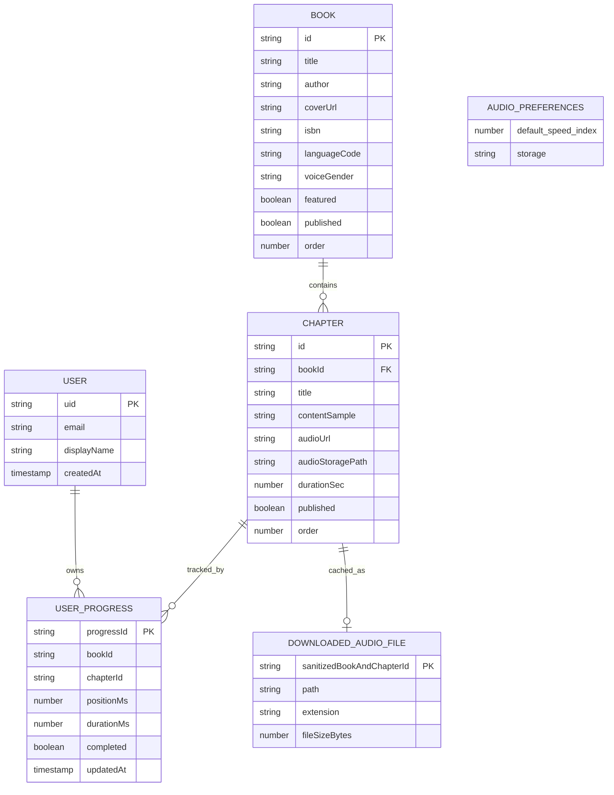

## 12. UI/UX Design Documentation

### Screen Documentation

| Screen | Purpose | Main UI Components | User Actions | Validation | Navigation |
|---|---|---|---|---|---|
| Login | Authenticate an existing user. | Email field, password field, sign-in button, register link. | Enter credentials, sign in, open registration. | Valid email format; password must not be empty. | Register or Discover. |
| Register | Create a new account. | Email field, password field, confirm password field, create account button, sign-in link. | Enter account data, submit registration. | Valid email; password at least 6 characters; confirmation must match. | Login or Discover. |
| Discover | Present published and featured audiobooks. | Featured cards, regular book cards, cover images, bottom navigation, empty state. | Browse books, open book detail, switch tabs. | Handles empty Firestore result and load failure. | Book Detail, Search, Library, Profile. |
| Search | Filter the catalog by query. | Search input, result rows, section label, bottom navigation, empty state. | Type query, select result, switch tabs. | Empty query shows all loaded books; no match shows an empty state. | Book Detail, Discover, Library, Profile. |
| Library | Show saved audiobooks filtered by progress and download state. | Filter chips, saved library rows, progress bars, bottom navigation, empty state. | Switch filters, open book detail. | Empty states vary by selected filter and saved-library availability. | Book Detail, Discover, Search, Profile. |
| Book Detail | Show a playlist-style view for a selected audiobook. | Cover, title, author, chapter summary, play/resume, save/bookmark, disabled download-all icon, chapter rows, chapter progress/download state, creator publish/add-chapter actions during preview. | Save or unsave the book, resume a chapter, choose a chapter, download a chapter from its row, publish a ready creator upload, add a creator chapter, exit. | Missing book ID, book load failure, chapter load failure, no-chapter states, and invalid publish states show messages. | Reader, Manage Chapter, or previous screen. |
| Reader | Read selected chapter text and control audio. | Exit icon, text-format placeholder, chapter download icon, title, chapter content, seek bar, time labels, play/pause, previous/next chapter buttons, speed. | Play, pause, seek within the chapter, move to the previous or next chapter, change speed, download current chapter, exit. | Missing book ID, missing chapter, missing audio URL, and download failure show messages. | Back to previous screen. |
| Profile | Show account and reading statistics plus creator entry points. | Name, email, completed count, listened hours, Account Settings, Audio Preferences, Create Audiobook, My Uploads, logout, bottom navigation. | Edit display name, open audio preferences, create an audiobook, open My Uploads, view stats, log out, switch tabs. | Unauthenticated fallback shows generic reader values; display name cannot be empty. | Login, Discover, Search, Library, Audio Preferences, Create Audiobook, My Uploads. |
| Create Audiobook | Create or edit a user-generated audiobook draft. | Title, author, optional cover URL, chapter text, word counter, Patrick/Ruth voice chips, save draft, request generation. | Save draft, save and request generation, edit existing draft, return to My Uploads. | Title and author are required and limited to 120 characters; chapter text is required and limited to 3,500 words; backend validation maps field errors back to chapter text. | My Uploads or previous screen. |
| Manage Chapter | Add or edit a chapter draft on a user-generated audiobook. | Chapter title, chapter text, word counter, Patrick/Ruth voice chips, save draft, request generation. | Save chapter draft, save and request generation, edit existing draft chapter. | Chapter title and text are required; chapter text is limited to 3,500 words. | My Uploads or previous screen. |
| My Uploads | Manage creator-owned generated audiobooks and chapters. | Upload cards, status chips, visibility chips, chapter panel, retry/request buttons, preview/publish actions, add chapter, overflow delete/cancel actions, live empty/error state panel. | Create upload, edit drafts, add/edit chapters, request/retry generation, preview audiobook or chapter, publish, make public/private, delete/cancel non-published chapters. | Requires signed-in user, Firebase config, backend base URL for writes, and valid book/chapter IDs. Notification permission is requested on Android 13+ when needed. | Create Audiobook, Manage Chapter, Book Detail creator preview, Reader single-chapter preview, or previous screen. |
| Audio Preferences | Manage local audio settings. | Reader-style exit icon, default speed chips, grouped downloaded chapter list, file sizes, delete buttons, empty state. | Choose default playback speed, delete downloaded chapter MP3 files, return to Profile. | Invalid speed indexes fall back to `1.0x`; delete failures show a message. | Profile. |

### Navigation Flow Diagram

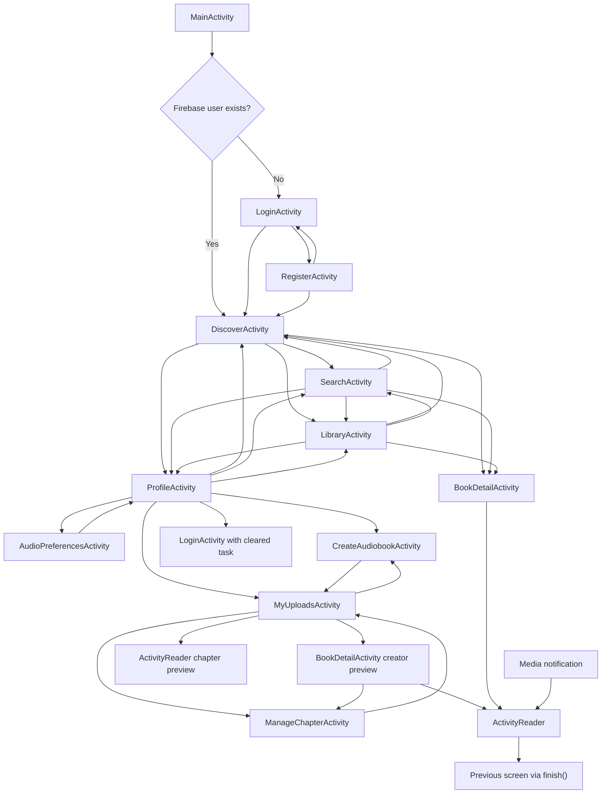

### UI/UX Principles Applied

- Clarity: each major screen has one dominant purpose, such as signing in,
  browsing, searching, listening, or viewing profile statistics.
- Consistency: bottom navigation is shared across Discover, Search, Library,
  and Profile.
- Feedback: loading, empty, success, and failure messages are displayed with
  TextViews or Toasts.
- Error prevention: forms validate email, password length, and password
  confirmation before calling Firebase.
- Accessibility: text labels, recognizable icons, progress indicators, and
  clear button states should be maintained. Future work should add stronger
  content descriptions for all interactive icons.
- Modern style direction: the current card-based layout, rounded chips,
  bottom navigation, cover images, and clean color system are suitable for an
  audiobook MVP.

## 13. Main Features Design

### Feature 1: Authentication

- Description: Users register, log in, stay authenticated across launches, and
  log out from Profile. Authenticated users can also update their display name.
- Related screens: Login, Register, Profile, Main launcher.
- Related classes: `MainActivity`, `LoginActivity`, `RegisterActivity`,
  `ProfileActivity`, `AuthRepository`, `FirebaseConfig`.
- Input: email, password, password confirmation, display name.
- Output: Firebase user session and user profile document.
- Validation: email must match Android email pattern; password must not be
  empty for login; registration password must be at least 6 characters and
  match confirmation; display name must not be empty.
- Error handling: Firebase errors are converted into user-readable messages,
  including a specific missing-configuration message.
- Expected behavior: authenticated users open Discover; unauthenticated users
  open Login; display name edits update Firebase Auth, merge into the user
  document, and refresh the Profile screen.

### Feature 2: Audiobook Discovery and Search

- Description: Users browse published books and filter the catalog by title or
  author, then open a playlist-style book detail screen.
- Related screens: Discover, Search, and Book Detail.
- Related classes: `DiscoverActivity`, `SearchActivity`, `BookDetailActivity`,
  `BookRepository`, `Book`, `BookChapter`, `BookCoverLoader`.
- Input: Firestore book data and optional search query.
- Output: visible book cards, search rows, and chapter playlist rows.
- Validation: Firestore documents are mapped with safe defaults for missing
  title, author, language, voice, duration, and order fields; chapter documents
  require correct Firestore field types for ordering and published state.
- Error handling: empty and load-failure states are shown when the catalog is
  unavailable, and chapter load failures are shown on Book Detail.
- Expected behavior: selecting a book opens `BookDetailActivity`; selecting or
  resuming a chapter opens `ActivityReader` with `book_id` and `chapter_id`.

### Feature 3: Playback and Progress Tracking

- Description: Users listen to a selected chapter, start new reader sessions at
  their saved default speed, resume from the saved chapter position, and move
  between playable chapters in the current audiobook.
- Related screens: Book Detail, Reader, Library, Profile, Audio Preferences.
- Related classes: `ActivityReader`, `PlaybackService`, `AudioSourceResolver`,
  `AudioPreferences`, `ProgressRepository`, `BookChapter`, `UserProgress`,
  ExoPlayer, `MediaController`, `MediaSession`.
- Input: selected book ID, chapter ID, book document, chapter document, audio
  source, saved progress, default speed preference.
- Output: audio playback, seek bar updates, saved Firestore progress.
- Validation: the reader checks for missing book ID, missing chapter, missing
  book document, and missing audio source.
- Error handling: player controls are disabled if no playable source exists.
- Expected behavior: progress is saved on pause, stop, playback end, chapter
  transition, and service destruction; audio continues when the user leaves
  `ActivityReader`; the chapter is finished when position reaches 95 percent of
  duration; tapping the media notification returns to the current reader chapter
  when available.

### Feature 4: Audio Download and Local Playback

- Description: Users download chapter MP3 files for local playback, view local
  download sizes, and delete downloaded chapter files.
- Related screens: Book Detail, Reader, Library, and Audio Preferences.
- Related classes: `DownloadedAudioRepository`, `AudioSourceResolver`,
  `ActivityReader`, `BookDetailActivity`, `AudioPreferencesActivity`.
- Input: `Book.id`, `BookChapter.id`, and chapter `audioUrl`.
- Output: internal MP3 file, updated download state, or removed local file.
- Validation: the book, chapter, and chapter `audioUrl` must exist; HTTP status
  must be 2xx; the file must not be empty; deletion succeeds only when the
  local file is absent or removable.
- Error handling: failed downloads remove temporary files and show a message.
- Expected behavior: local MP3 is preferred over the remote URL after download.
  Deleting a chapter MP3 removes offline playback for that chapter and lets
  future playback fall back to the remote `audioUrl`.

### Feature 5: Library and Profile Statistics

- Description: Users save published audiobooks into their library, then view
  saved books by listening, downloaded, and finished status, plus basic profile
  statistics and account/audio/creator entry points.
- Related screens: Book Detail, Library, Profile, and Audio Preferences.
- Related classes: `LibraryActivity`, `ProfileActivity`, `BookRepository`,
  `SavedBookRepository`, `ProgressRepository`, `DownloadedAudioRepository`,
  `AudioPreferences`.
- Input: saved book IDs, published visible books, published chapters, saved
  chapter progress, local chapter file availability, local audio preference
  values.
- Output: saved/unsaved state, filtered library rows, aggregate completion
  percentage, remaining time, completed book count, listened hours, display
  name, default speed choice, and grouped downloaded chapter list.
- Validation: missing progress defaults to `UserProgress.empty(bookId,
  chapterId)`; saved-library reads fall back to an empty library when the user
  is signed out or Firebase is unavailable.
- Error handling: empty states are shown for each filter.
- Expected behavior: the Library and Profile screens update using the latest
  saved-book IDs, chapter progress, and local download data; Audio Preferences
  persists default speed for future reader sessions.

### Feature 6: Creator Uploads and My Uploads

- Description: Signed-in users create generated-audiobook drafts, manage
  chapters, request AWS Polly generation through the backend, preview ready
  audio, publish ready uploads, and manage public/private visibility.
- Related screens: Profile, Create Audiobook, Manage Chapter, My Uploads, Book
  Detail creator preview, and Reader chapter preview.
- Related classes: `CreateAudiobookActivity`, `ManageChapterActivity`,
  `MyUploadsActivity`, `CreatorAudiobookRepository`, `CreatorApiClient`,
  `CreatorApiContract`, `BookAccessPolicy`, `BookRepository`,
  `GenerationNotificationSetup`, `GenerationNotificationMessagingService`,
  `UploadNotificationTokenRepository`, `UserGeneratedAudiobook`,
  `UserGeneratedChapter`, `AudiobookGenerationStatus`.
- Input: authenticated Firebase user, backend base URL, title, author,
  optional cover URL, chapter title/text, voice (`Patrick` or `Ruth`), and
  selected upload/chapter IDs.
- Output: trusted Firestore book/chapter documents, generation status updates,
  S3-backed `audioUrl` values after completion, creator preview access,
  published public catalog entries, hidden/private creator entries, and
  best-effort FCM notifications.
- Validation: title and author are required and limited to 120 characters;
  chapter text is required and limited to 3,500 words; Android excludes
  identity, AWS, S3, engine, output, and markup settings from creator payloads.
- Error handling: backend validation errors are shown near the chapter text
  when possible; failed generation shows sanitized `generationError`; draft
  save followed by generation-request failure returns to My Uploads with a
  partial-success message; notification failure does not fail generation.
- Expected behavior: My Uploads observes both the creator's books and chapter
  subcollections live, supports `draft`, `pending_generation`, `failed`,
  `ready_for_review`, `published`, `rejected`, and `deleted` states, hides
  deleted chapters, allows delete/cancel only for non-published chapters, and
  keeps unpublished content out of Discover/Search unless the creator opens
  preview mode.

## 14. Permissions and Android Components

### Android Components

| Component | Used? | Implementation |
|---|---|---|
| Activity | Yes | `MainActivity`, `LoginActivity`, `RegisterActivity`, `DiscoverActivity`, `SearchActivity`, `LibraryActivity`, `BookDetailActivity`, `ProfileActivity`, `CreateAudiobookActivity`, `ManageChapterActivity`, `MyUploadsActivity`, `AudioPreferencesActivity`, `ActivityReader`. |
| Fragment | No | The app currently uses Activity-based screens only. |
| Service | Yes | `.audio.PlaybackService` extends Media3 `MediaSessionService`, and `.notifications.GenerationNotificationMessagingService` handles FCM upload-generation messages. Both are declared in `AndroidManifest.xml`. |
| Foreground Service | Yes | `PlaybackService` uses `android:foregroundServiceType="mediaPlayback"` for ongoing audiobook playback. |
| BroadcastReceiver | No | No receiver is declared or registered. |
| AlarmManager / WorkManager | No | The app does not schedule background work. |
| Media notification | Yes | Media3 `DefaultMediaNotificationProvider` creates playback notification controls for the active `MediaSession`; upload-generation completion/failure uses a separate notification channel that opens My Uploads. |
| ContentProvider | No | No provider is declared. |

### Permissions

| Permission | Purpose | Requested When | Privacy Consideration |
|---|---|---|---|
| `android.permission.INTERNET` | Required for Firebase Authentication, Firestore reads/writes, cover image loading, and remote MP3 download/playback. | Declared in `AndroidManifest.xml`; granted at install time as a normal permission. | The app transmits authentication data through Firebase SDKs and downloads remote media from configured URLs. |
| `android.permission.FOREGROUND_SERVICE` | Allows the app to run a foreground service. | Declared in `AndroidManifest.xml`. | Used only for playback service lifecycle. |
| `android.permission.FOREGROUND_SERVICE_MEDIA_PLAYBACK` | Required on modern Android for foreground services with media playback type. | Declared in `AndroidManifest.xml`. | Applies to ongoing audiobook playback and media controls. |
| `android.permission.POST_NOTIFICATIONS` | Allows Android 13+ devices to show upload-generation completion or failure notifications. | Requested from My Uploads when generation is requested or pending uploads are visible. | Denial does not affect live Firestore refresh; it only suppresses system notifications. |

No storage permission is required because downloaded MP3 files are saved inside
the app-private internal files directory.

## 15. Error Handling and Validation

| Scenario | Current Handling | Recommended Documentation Expectation |
|---|---|---|
| Empty login password | `inputPassword.setError` and focus request. | Keep inline validation before Firebase calls. |
| Invalid email | Android `Patterns.EMAIL_ADDRESS` validation. | Apply consistently to login and registration. |
| Short password | Registration requires at least 6 characters. | Keep aligned with Firebase password expectations. |
| Password mismatch | Confirmation field receives an error. | Prevent registration request until fixed. |
| Duplicate account or auth failure | Firebase failure is displayed through `AuthRepository.friendlyError`. | Show user-readable message without exposing stack traces. |
| Empty profile display name | Custom Profile dialog keeps focus on the input and shows an inline error. | Prevent profile update until a non-empty name is entered. |
| Missing Firebase config | Friendly error says to add `google-services.json`. | Treat as setup failure for developers/testers. |
| Firestore book load failure | Empty state and Toast are shown. | Keep screen usable and avoid crashes. |
| Missing `book_id` extra | Book Detail or Reader shows a Toast and finishes. | Prevent invalid navigation state. |
| Missing book document | Reader shows a Toast and finishes. | Treat as stale or invalid navigation. |
| Missing chapter or chapter document | Reader shows a Toast and finishes, or Book Detail shows a chapter loading message. | Treat as stale or invalid navigation. |
| Missing audio URL | Player controls are disabled and a missing-audio message is shown for the selected chapter. | Prevent player errors. |
| Download HTTP failure | Repository reports an IOException and deletes temporary file. | Do not leave partial MP3 files as valid downloads. |
| Download delete failure | Audio Preferences keeps the row visible and shows a Toast. | Avoid pretending offline audio was removed when file deletion fails. |
| Invalid default speed index | `AudioPreferences` clamps the index back to `1.0x`. | Keep playback speed deterministic even if local preferences are corrupted. |
| Missing backend base URL | Creator repository reports that the backend base URL is not configured. | Configure debug `BACKEND_BASE_URL` or keep creator write actions unavailable for release until an HTTPS backend exists. |
| Creator text too long | Local word counter blocks text over 3,500 words, and backend validation can map `chapterText` errors back to the input. | Keep Android and backend validation aligned. |
| Draft saved but generation request fails | The app reports partial success and returns to My Uploads so the creator can retry. | Do not lose accepted draft content when generation queueing fails. |
| Failed generation | My Uploads displays the sanitized generation error and enables retry when status allows it. | Avoid exposing source text or internal stack details. |
| Delete/cancel invalid chapter | Backend rejects published or otherwise non-deletable chapters and Android keeps the row visible. | Published chapters cannot be deleted in the current version. |
| Internet unavailable | Firebase or HTTP callbacks fail and display messages. | Future work should add clearer offline-specific states. |
| Unexpected lifecycle interruption | `ActivityReader.onStop()` saves progress and releases only the `MediaController`; `PlaybackService` keeps ExoPlayer alive for background playback and saves progress on pause/end/chapter transition/destroy. | Preserve progress while allowing background audio. |

## 16. Deployment and Build Guide

### Environment Requirements

- Android Studio with support for Android Gradle Plugin 9.2.1.
- JDK compatible with Java 11 source and target settings.
- Android SDK platform for compile SDK release 36 with minor API level 1.
- Android device or emulator running Android 7.0 or newer, based on minSdk 24.
- Firebase project with Authentication and Cloud Firestore enabled.
- `app/google-services.json` downloaded from Firebase Console and placed in the
  `app/` directory.
- For creator audiobook generation, run the sibling `Fonos_Audiobook_Backend`
  service locally and set `BACKEND_BASE_URL=http://10.0.2.2:8080` in
  `local.properties` for Android Emulator debug builds. Keep `local.properties`
  uncommitted.

### Open the Project

1. Open Android Studio.
2. Select the repository root: `D:\Dai Hoc\Nam 3\HK2\Mobile\Fonos\Fonos_Group13`.
3. Allow Gradle sync to complete.
4. Confirm the `:app` module is selected.

### Gradle Configuration

Important build configuration:

- Application ID: `com.example.fonos_group13`.
- Namespace: `com.example.fonos_group13`.
- Version code: `1`.
- Version name: `1.0`.
- minSdk: `24`.
- targetSdk: `36`.
- compileSdk: release `36`, minor API level `1`.
- Java source/target compatibility: `JavaVersion.VERSION_11`.
- Firebase Google Services plugin is applied only if `app/google-services.json`
  exists.
- Debug builds expose `BuildConfig.BACKEND_BASE_URL` from `local.properties`,
  defaulting to the emulator bridge URL `http://10.0.2.2:8080`; release builds
  leave the value empty unless an HTTPS backend URL is configured explicitly.

Major dependencies:

- AndroidX AppCompat, Core KTX, Activity KTX, ConstraintLayout.
- Material Components.
- Firebase BoM, Firebase Auth, Firebase Firestore, Firebase Messaging.
- Media3 ExoPlayer, Media3 Common, and Media3 Session.
- Glide.
- JUnit, AndroidX JUnit, Espresso.

### Build and Run

From the project root on Windows:

```powershell
.\gradlew.bat assembleDebug
```

To install and run from Android Studio:

1. Select a physical Android device or emulator.
2. Choose the `app` run configuration.
3. Click Run.
4. Sign in with an existing Firebase user or register a new account.

### APK Output

The debug APK is generated under:

```text
app/build/outputs/apk/debug/
```

For a release build:

```powershell
.\gradlew.bat assembleRelease
```

The current release build has minification disabled. A production release should
add signing configuration, review ProGuard/R8 rules, and verify Firebase
security rules.

## 17. Limitations and Future Improvements

### Current Limitations

- Firestore is required for catalog and progress data; only downloaded audio
  files are locally available.
- The media service exposes playback controls, but it does not implement a full
  `MediaLibraryService` browse tree.
- The app includes user-created audiobook screens, creator preview, and an
  authenticated backend write path for draft, chapter, generation,
  publication, visibility, and delete/cancel actions. A real demo still
  requires Firebase Admin credentials, AWS credentials, and the public demo S3
  bucket described in the sibling backend README.
- Search is local over the currently loaded book list, not a server-side or
  indexed search.
- The Library screen binds a limited number of visible rows.
- Audio Preferences manages downloaded chapters only for books still present in
  the published catalog; orphaned files for removed Firestore books are not
  listed.
- There is no explicit retry queue for failed progress saves.
- Automated coverage is still light, but creator preview access policy has an
  app-specific unit test.

### Future Improvements

- Harden and deploy the local Node.js + Express backend if user-generated
  audiobooks move beyond the laptop demo.
- Add signed URLs or an authenticated audio proxy before storing private or
  production generated audio.
- Add review/moderation handling for user-created books if external approval
  becomes required later.
- Add book-level star ratings and short text reviews, with rating summaries on
  book documents.
- Add a richer media browse tree if Android Auto, assistant, or external media
  browser clients become a requirement.
- Add Room caching for catalog metadata and progress fallback.
- Add orphaned-download cleanup for audio files whose books are no longer
  published.
- Add Firebase Storage integration if `audioStoragePath` becomes the primary
  source for media.
- Add richer search, categories, recommendations, and recently played lists.
- Add dark mode polish and stronger accessibility support.
- Add multi-language UI support and clearer Vietnamese/English resource
  management.
- Add analytics, crash reporting, and structured logging.
- Add Firebase security rules and emulator-backed integration tests.
- Add CI checks for unit tests, instrumentation tests, lint, and build.

## 18. Conclusion

`Fonos_Group13` implements a focused Android audiobook reader MVP. It solves the
core user problem of finding an audiobook, playing it, downloading it for local
use, and resuming from saved progress inside one authenticated mobile
experience.

The MVC architecture supports this prototype by separating XML resources as the
View, Activities as the Controller, and model/repository classes as the Model
and data boundary. This organization is understandable for a university Android
project and provides a clear path for developers to locate UI, behavior, and
data responsibilities.

This documentation gives developers, testers, and reviewers a shared technical
reference. Developers can use it to understand the current architecture and data
contracts. Testers can use it to derive acceptance and regression scenarios.
Reviewers can use it to evaluate whether the implementation matches the stated
MVP scope and where the next engineering improvements should be made.
