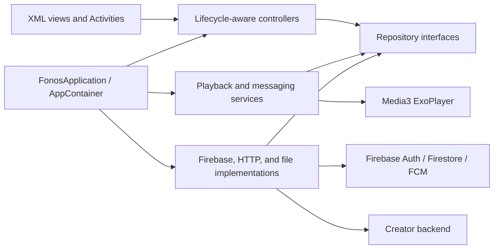

# Fonos Android Audiobook Reader

`Fonos_Group13` is a Java/XML Android audiobook app for discovering, saving,
listening to, downloading, and creating audiobooks. Firebase provides account
and catalog data, Media3 owns background playback, and a companion backend
handles trusted creator operations and AWS Polly generation.

The repository remains a single `:app` module using MVC. Activities render XML
views, lifecycle-aware controllers coordinate screen state, and repository
interfaces keep Firebase and network implementations out of the UI layer.

## Features

### Reader experience

- Register, sign in, edit the profile display name, and sign out with Firebase
  Authentication.
- Browse published audiobooks and search the loaded catalog by title or author.
- Save books and filter the library by Listening, Downloaded, or Finished.
- Open a book playlist, choose a chapter, and resume saved progress.
- Play audio in the background with notification and lock-screen controls.
- Seek, move between chapters, and choose a default playback speed.
- Download chapter MP3 files to app-private storage and delete them later.
- View completed-book and listening-time statistics on the profile screen.
- View average ratings on Discover, Search, Library, and Book Detail.
- Add one editable 1-5 star review per published book, optionally with a
  comment of up to 1,000 characters, and delete that review later.
- Browse written reviews newest-first in pages of ten and see the current
  number of users who saved a book.
- Ask AI for a grounded chapter or whole-book summary, ask follow-up questions,
  switch scope, and inspect exact source citation cards in English or Vietnamese.

### Creator experience

- Create or edit audiobook and chapter drafts.
- Select the supported Patrick or Ruth voice and request AWS Polly generation.
- Observe live book and chapter generation states in My Uploads.
- Retry failed generation and preview ready audio before publishing.
- Publish ready audiobooks and switch published uploads between public and
  private visibility.
- Receive best-effort Firebase Cloud Messaging notifications when generation
  completes or fails.

Creator writes are sent through the authenticated backend. The Android client
does not accept AWS credentials, ownership fields, output locations, or other
trusted generation settings from the user.

## Technology

| Area | Implementation |
| --- | --- |
| Language and UI | Java 11, Android XML layouts, Material Components |
| Android support | minSdk 24, targetSdk 36, compile SDK 36.1 |
| Authentication and data | Firebase Authentication and Cloud Firestore |
| Notifications | Firebase Cloud Messaging |
| Playback | Media3 ExoPlayer and `MediaSessionService` |
| Images | Glide |
| Local state | App-private files and SharedPreferences |
| Creator generation | Node.js backend, AWS Polly, and S3 |
| Book AI | Authenticated backend, DeepSeek chat, Gemini embeddings, Firestore vector search |
| Tests | JUnit 4, AndroidX Test, and Espresso |

## Architecture

The app uses an Activity-centered MVC structure with explicit dependency and
data boundaries.



### Composition root

`FonosApplication` creates one `DefaultAppContainer` for the application. The
container owns Firebase-backed repositories, creator HTTP dependencies, the
audio download repository, a bounded shared I/O executor, and a main-thread
handler.

Activities and Android services obtain dependencies from `AppContainer`; they
do not construct repositories or import Firebase implementation types. Tests
can replace the application and container with fakes without connecting to
Firebase.

### Controllers

Controllers coordinate asynchronous work for catalog, library, profile, audio
preferences, creator, book-detail, and reader flows. Their request generations
reject stale callbacks after a reload or lifecycle stop. Screens receive one
coherent state instead of rebinding every partial repository result.

Activities still own Android view binding, navigation, dialogs, permissions,
and lifecycle callbacks. `PlaybackService` separately owns ExoPlayer and the
MediaSession so playback survives reader Activity recreation.

### Repository boundary

UI and controllers depend on these interfaces:

- `AuthRepository`
- `CatalogRepository`
- `SavedBooksRepository`
- `ProgressRepository`
- `AudioDownloadRepository`
- `CreatorCommandRepository`
- `CreatorUploadsRepository`
- `BookCommunityRepository`
- `AiChatRepository`

Production repositories map Firestore documents into pure Java models. Firebase
snapshots and timestamps do not leak into controllers or Activities. Repository
callbacks are delivered on the main thread, while one-shot work and live
observers expose framework-neutral `RequestHandle` and `Subscription`
cancellation contracts.

### Main data flows

Catalog and library refresh:

1. Load the published catalog once.
2. Load the signed-in user's saved-book IDs and complete progress collection.
3. Load at most one chapter query for each relevant book.
4. Combine progress and local download state into the library or profile view
   state.

Reader playback:

1. `BookDetailDataController` loads the authorized book and its chapters.
2. `ReaderDataController` loads the selected chapter and saved progress.
3. `AudioSourceResolver` prefers a valid local MP3, then the remote `audioUrl`.
4. `ActivityReader` sends the playlist and metadata to `PlaybackService` through
   a Media3 controller.
5. `PlaybackService` saves observable progress during playback transitions and
   shutdown.

Creator workflow:

1. Pure validators check audiobook or chapter draft input.
2. `CreatorCommandRepository` sends `/api/v1` commands with the current Firebase
   ID token as a Bearer token.
3. The backend verifies ownership, writes trusted Firestore fields, and starts
   generation.
4. `CreatorUploadsRepository` observes the creator's books and chapter
   subcollections through cancellable subscriptions.
5. My Uploads renders `draft`, `pending_generation`, `failed`,
   `ready_for_review`, `published`, `rejected`, and `deleted` states.

Community workflow:

1. Catalog reads map `ratingAverage`, `ratingCount`, and `saveCount` from each
   book document, defaulting missing legacy values to zero.
2. Book Detail loads comment-bearing reviews through the authenticated backend
   while keeping the caller's rating-only review available for editing.
3. Review and save mutations wait for the backend transaction before changing
   confirmed UI state; failed online requests remain retryable.
4. The backend derives reviewer identity from Firebase Authentication and
   returns updated aggregates after every mutation.

Review loading depends on the backend Firestore composite index for
`hasComment ASC`, `createdAt DESC`, and document ID descending. The index for
project `fonos-group13-44726` was verified `READY` on 2026-07-11. If the index
is missing or still building, Book Detail keeps the retry action visible while
the backend reports `FAILED_PRECONDITION`.

Ask AI workflow:

1. `BookDocumentMapper` maps `aiStatus`; missing legacy values default to
   `unavailable`.
2. Book Detail opens whole-book scope and Reader opens the current chapter.
   `unavailable`, `indexing`, `failed`, draft, hidden, and creator-preview
   states keep the action disabled and show the reason.
3. `AiChatController` sends complete non-streamed requests through
   `AiChatRepository` with the current Firebase ID token.
4. The backend validates the published active content version, builds summaries
   from all scoped chunks or performs book/chapter vector retrieval for Q&amp;A,
   and returns backend-validated citation excerpts.
5. The screen retains at most the open session's in-memory conversation,
   restores it across rotation, warns once before whole-book spoilers, and
   cancels outstanding work when stopped. Closing the screen clears the chat.

## Data and Local Storage

| Location | Purpose |
| --- | --- |
| `books/{bookId}` | Published catalog metadata and creator upload state |
| `books/{bookId}/chapters/{chapterId}` | Chapter text, order, duration, audio, and generation state |
| `books/{bookId}/aiIndexVersions/...` | Backend-only immutable AI chunks and summary cache; Android access is denied |
| `books/{bookId}/reviews/{uid}` | One server-owned rating and optional comment per user |
| `users/{uid}` | Basic account profile data |
| `users/{uid}/savedBooks/{bookId}` | Saved-library membership |
| `users/{uid}/progress/{progressId}` | Position, duration, completion, and update time per chapter |
| `users/{uid}/notificationTokens/{tokenId}` | FCM tokens used for creator generation notifications |
| `files/audiobooks/` | Downloaded chapter MP3 files and temporary replacements |
| `SharedPreferences: audio_preferences` | Default playback speed |

Firestore remains the source of truth for catalog, saved-book, progress, and
creator metadata. Downloaded audio and playback-speed preferences are local to
the current device.

Review, aggregate, and saved-membership writes are backend-authoritative.
Android can read its own saved membership but cannot directly update those
documents after the community-feature rules cutover.

## Project Layout

```text
Fonos_Group13/
├── app/
│   ├── src/main/
│   │   ├── java/com/example/fonos_group13/
│   │   │   ├── audio/          # Playback service and source resolution
│   │   │   ├── controller/     # Catalog, library, profile, creator, reader
│   │   │   ├── data/           # Interfaces and Firebase/HTTP/file adapters
│   │   │   ├── model/          # Pure Java domain and immutable state types
│   │   │   ├── notifications/  # FCM setup and message handling
│   │   │   └── ui/             # Shared Android UI helpers
│   │   ├── res/                # XML layouts, strings, themes, and drawables
│   │   └── AndroidManifest.xml
│   ├── src/test/                # JVM repository, controller, and policy tests
│   └── src/androidTest/         # Fake-container instrumentation setup
├── gradle/libs.versions.toml
└── settings.gradle.kts
```

## Setup

### Requirements

- Android Studio compatible with the project's Android Gradle Plugin.
- A JDK supported by the project's Android Gradle Plugin; app source and target
  compatibility remain Java 11.
- Android SDK platform 36.1.
- An emulator or device running Android 7.0 (API 24) or newer.
- A Firebase project with Authentication, Cloud Firestore, and Cloud Messaging
  configured.
- The companion backend when testing creator operations or Ask AI.

### Firebase

1. Register an Android app with application ID
   `com.example.fonos_group13`.
2. Download `google-services.json` from Firebase Console.
3. Place it at `app/google-services.json`.
4. Enable Email/Password authentication and deploy the Firestore configuration
   required by the project.

The Gradle build applies the Google Services plugin only when the configuration
file exists. The project can still compile without it, but authentication,
Firestore, and messaging flows will not operate normally.

Do not commit `google-services.json`, service-account files, AWS credentials, or
other secrets.

### Creator backend

Debug builds default to the Android Emulator host bridge:

```properties
BACKEND_BASE_URL=http://10.0.2.2:8080
```

Add the value to the root `local.properties` when a different backend address is
needed. Use the development machine's reachable LAN address for a physical
device. Release builds require an explicitly configured HTTPS URL; otherwise
their backend URL is empty.

Run and configure the companion backend with Firebase Admin, AWS, S3, a
backend-only DeepSeek API key for chat, and a backend-only Gemini API key for
embeddings before testing generation or Ask AI. Deploy its Firestore rules and
both 768-dimensional vector indexes, populate complete `sourceText` for every
published chapter, then run `npm run ai:index -- --all`.
Backend setup and route contracts are
documented in the [Fonos Backend repository](https://github.com/LeeVuKhang/Fonos_Backend).

## Build and Verify

Run commands from the repository root.

Build the debug APK:

```powershell
.\gradlew.bat assembleDebug
```

Run JVM tests:

```powershell
.\gradlew.bat testDebugUnitTest
```

Compile the instrumentation APK:

```powershell
.\gradlew.bat assembleDebugAndroidTest
```

Run lint:

```powershell
.\gradlew.bat lintDebug
```

Run instrumentation tests when an emulator or device is connected:

```powershell
.\gradlew.bat connectedDebugAndroidTest
```

The debug APK is written to `app/build/outputs/apk/debug/`. Instrumentation uses
`FonosTestRunner` and `FonosTestApplication`, which provide a fake
`TestAppContainer` instead of live Firebase repositories.

## Compatibility and Failure Behavior

- A chapter is complete when saved playback reaches at least 95% of a positive
  duration. A book is finished when all relevant chapters are complete.
- New downloads use `bookId__chapterId.mp3` under app-private storage. Legacy
  single-chapter `bookId.mp3` files remain readable and deletable.
- Downloads use temporary files and replacement semantics. A failed replacement
  preserves an existing valid download.
- Playback prefers downloaded audio and falls back to the chapter's remote URL.
- Progress writes remain compatible with Firestore offline persistence; failed
  callbacks are logged instead of silently ignored.
- Root authentication, catalog, or saved-library failures produce error states.
  Per-book chapter failures preserve successful rows and use the existing empty
  defaults for the failed book.
- Controllers cancel active requests or subscriptions and ignore stale results
  after reloads and lifecycle stops.
- Creator draft creation preserves the partial-success case where the draft is
  saved but the generation request fails.
- Review and save mutations require backend connectivity and do not use an
  offline retry queue.
- Ask AI requires a signed-in user, a running backend, an AI-ready visible
  published book, and network connectivity. It uses non-streamed responses,
  keeps no persistent history, limits questions to 1,000 characters, and maps
  readiness, rate-limit, provider, and offline failures to retryable UI states.
  Provider `Retry-After` responses keep the pending request but disable manual
  retry until the backend circuit permits another attempt.
- Notification permission denial does not block generation or other creator
  operations.

## Known Limitations

- Catalog and progress metadata require Firebase connectivity; only previously
  downloaded audio is available fully offline.
- Search filters the loaded catalog locally rather than using a server-side
  index.
- The playback service exposes media controls but not a full
  `MediaLibraryService` browse tree.
- Creator generation requires a separately running and correctly configured
  backend.
- Generated/private audio needs a production-grade signed URL or authenticated
  delivery policy before a public deployment.
- The project does not include Room caching, subscriptions, payments,
  recommendations, analytics, review replies/reporting, or a moderation console.

## Related Project

- [Fonos Backend](https://github.com/LeeVuKhang/Fonos_Backend) — authenticated
  creator commands, trusted Firestore writes, AWS Polly generation, S3 metadata,
  publication, visibility, deletion, and generation notifications.
