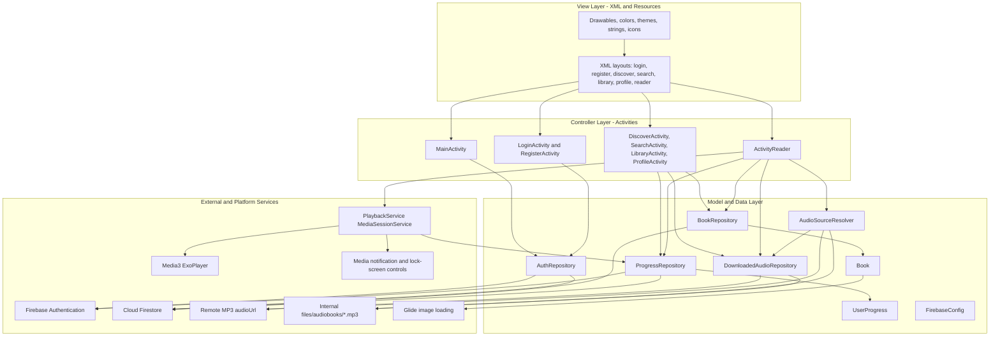
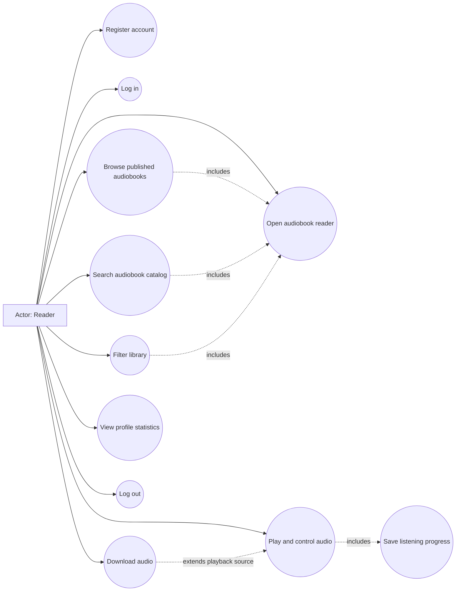
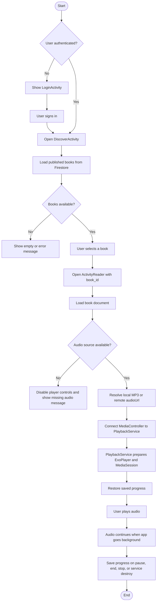
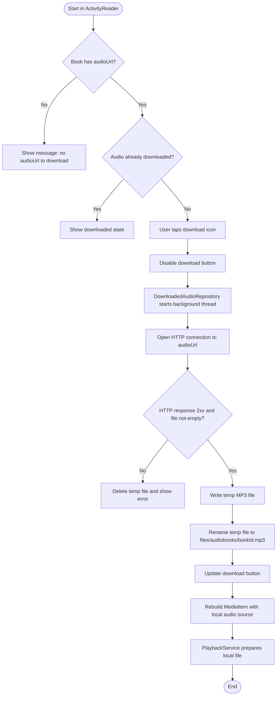
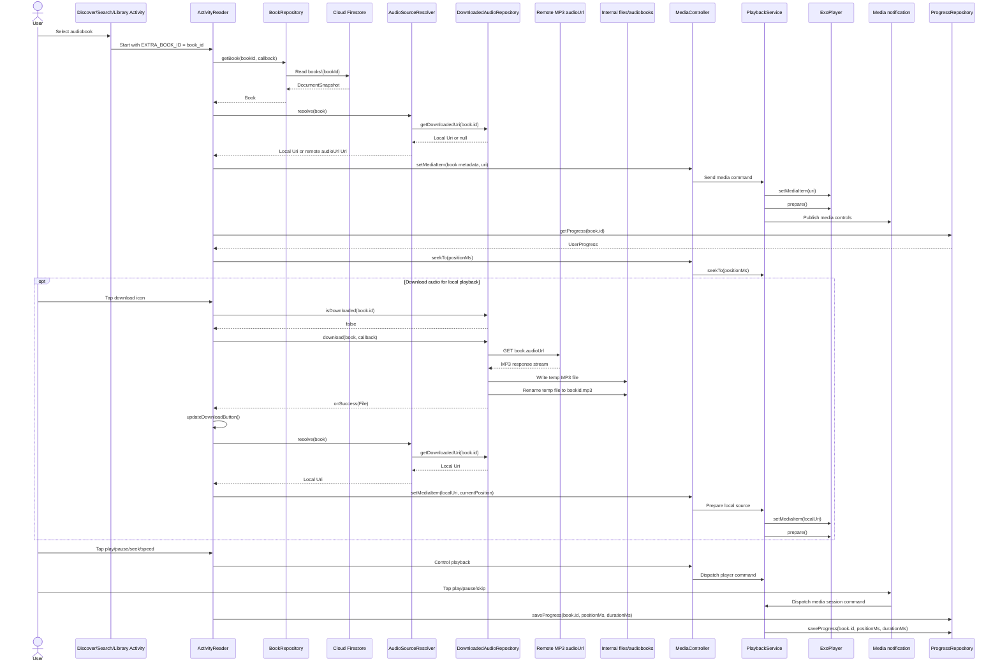
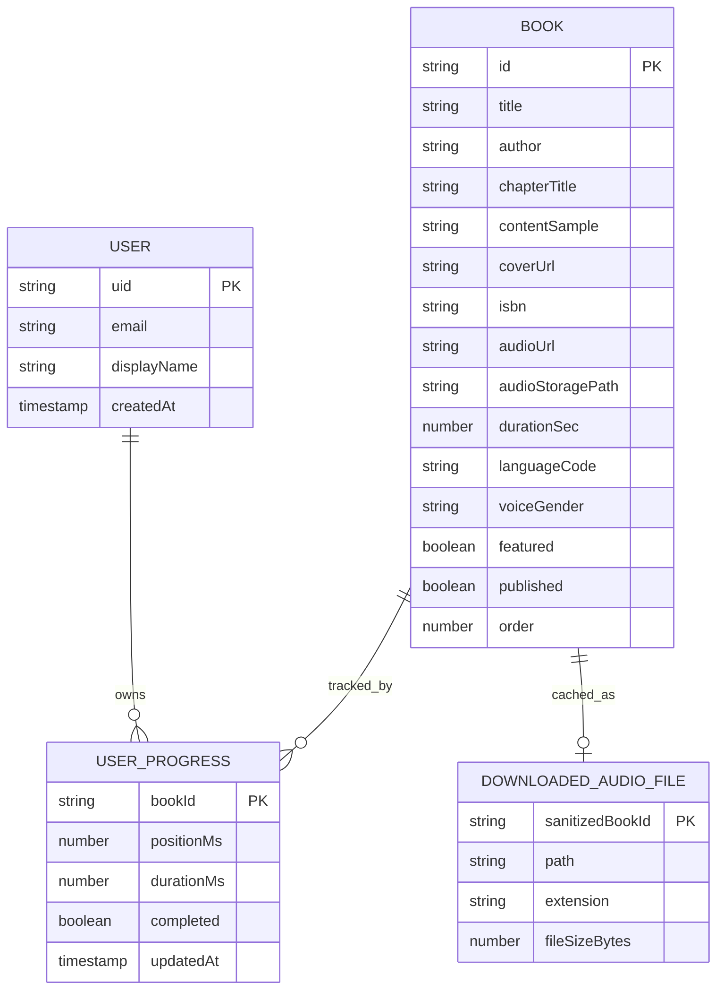
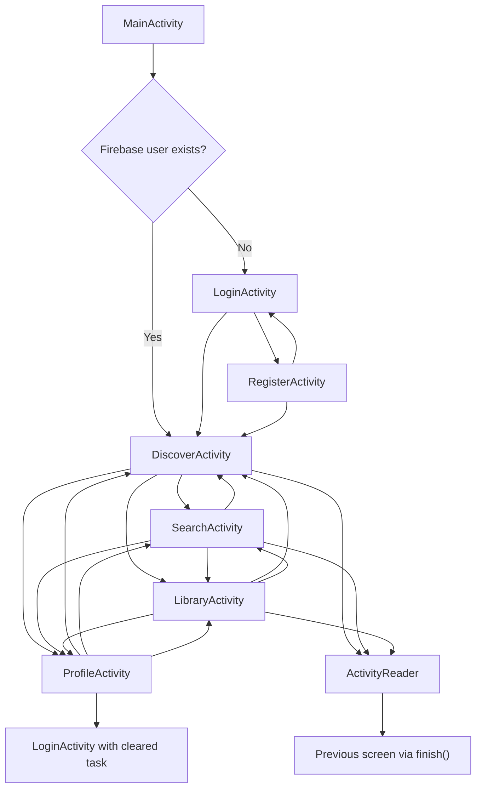

# Fonos Group 13 - Android Audiobook Reader Documentation

## 1. Project Overview

`Fonos_Group13` is an Android audiobook reader prototype. The application is
presented to users as `Book Reader`, with `Lumina` used as a visible product
brand in the current interface. The app allows a reader to sign in, discover
published audiobooks, search by title or author, play audio, download MP3 files
for local playback, track listening progress, and review basic profile
statistics.

The core problem addressed by the app is the fragmentation of reading,
listening, and progress tracking. Instead of requiring separate tools for book
discovery, audio playback, and completion status, the application provides one
mobile flow for browsing, listening, resuming, and managing an audiobook
library.

The primary users are students and general readers who want a lightweight
Android app for audiobook listening. The current version is best classified as
an MVP/prototype for a university mobile development project. It focuses on the
main learning and listening workflow rather than advanced production features
such as subscriptions, recommendations, analytics, or multi-device offline sync.

The main value of the application is a simple authenticated audiobook
experience:

- Firebase Authentication provides account access.
- Cloud Firestore stores published books and user listening progress.
- Media3 `MediaSessionService` owns ExoPlayer for background playback,
  notification media controls, and lock-screen controls.
- Internal app storage supports downloaded MP3 files.
- XML layouts provide a familiar Android interface for discovery, search,
  library, profile, login, registration, and reader screens.

## 2. Scope of the Application

### In Scope

- User registration with email and password.
- User login, session detection, and logout.
- Display of published audiobooks from Cloud Firestore.
- Featured and regular audiobook presentation on the Discover screen.
- Search by audiobook title or author.
- Library filtering by Listening, Downloaded, and Finished.
- Reader screen with content sample, chapter title, duration, seek bar, skip
  back, skip forward, play/pause, and playback speed controls.
- Audio playback from a remote `audioUrl` or a downloaded local MP3 file.
- Background audiobook playback through `PlaybackService`, a Media3
  `MediaSessionService` declared as a foreground media playback service.
- Media notification and lock-screen controls for play/pause, skip back 15s,
  and skip forward 15s.
- Downloading remote MP3 audio into app-private internal storage.
- Saving and restoring user listening progress.
- Profile display with email, display name fallback, completed book count, and
  listened-hours statistic.

### Out of Scope

- Payment, subscription, or premium content access.
- Social sharing, reviews, playlists, and recommendations.
- Push notifications or scheduled reminders outside the media playback
  notification.
- Room, SQLite, or SharedPreferences persistence for structured data.
- Admin tools for creating or editing books inside the mobile app.
- Multi-language UI management beyond the currently present string resources.
- Full offline catalog browsing when Firestore is unavailable.

### Assumptions

- The app is an MVP/prototype and prioritizes core flows over production-scale
  infrastructure.
- Cloud Firestore is the source of truth for the catalog and progress metadata.
- Downloaded MP3 files are stored only on the device where they were downloaded.
- A book is considered completed when the saved playback position reaches at
  least 95 percent of the duration.
- Firebase is configured through `app/google-services.json`; without this file,
  authentication and Firestore flows cannot operate normally.

### Constraints

- Platform: Android.
- Language and UI framework: Java with XML layouts.
- Architecture requirement: MVC.
- Minimum SDK: 24.
- Target SDK: 36.
- Compile SDK: Android release 36 with minor API level 1.
- Gradle Android plugin: 9.2.0.
- Java compatibility: Java 11.
- Network dependency: Firebase and remote MP3 URLs require internet access.
- Playback lifecycle: `PlaybackService` owns ExoPlayer and the `MediaSession`;
  `ActivityReader` controls it through a Media3 `MediaController`.

## 3. Functional Requirements

| Requirement ID | Requirement Name | Description | Priority | Related Screen/Module |
|---|---|---|---|---|
| FR-01 | Launch routing | The app shall route authenticated users to Discover and unauthenticated users to Login. | High | `MainActivity`, `AuthRepository` |
| FR-02 | User login | The app shall allow users to sign in with a valid email and password. | High | `LoginActivity`, Firebase Auth |
| FR-03 | User registration | The app shall allow users to create an account with email, password, and password confirmation. | High | `RegisterActivity`, Firebase Auth |
| FR-04 | User logout | The app shall allow users to sign out and clear the navigation stack back to Login. | High | `ProfileActivity`, `AuthRepository` |
| FR-05 | Display published books | The app shall load books where `published` is true from Firestore and sort them by `order`. | High | `DiscoverActivity`, `BookRepository` |
| FR-06 | Open reader | The app shall open the reader for a selected book using the `book_id` intent extra. | High | Discover, Search, Library, `ActivityReader` |
| FR-07 | Search catalog | The app shall filter loaded books by title or author as the user types. | Medium | `SearchActivity` |
| FR-08 | Filter library | The app shall filter library rows by listening, downloaded, and finished status. | Medium | `LibraryActivity`, `ProgressRepository`, `DownloadedAudioRepository` |
| FR-09 | Play audiobook | The app shall resolve an audio source and play it through Media3 ExoPlayer owned by `PlaybackService`. | High | `ActivityReader`, `PlaybackService`, `AudioSourceResolver` |
| FR-10 | Control playback | The app shall support play/pause, seek bar control, 15-second skip back/forward, speed cycling, and notification media controls. | High | `ActivityReader`, `PlaybackService`, `MediaController` |
| FR-11 | Save progress | The app shall save current playback position, duration, completion state, and update timestamp. | High | `ProgressRepository`, Firestore |
| FR-12 | Restore progress | The app shall seek to the last saved position when a book is reopened. | High | `ActivityReader`, `PlaybackService`, `ProgressRepository` |
| FR-13 | Download audio | The app shall download a book MP3 from `audioUrl` and store it in `files/audiobooks`. | Medium | `DownloadedAudioRepository` |
| FR-14 | Prefer local audio | The app shall prefer a downloaded local MP3 over the remote URL when both are available. | Medium | `AudioSourceResolver` |
| FR-15 | Display profile stats | The app shall display completed books and approximate listened hours for the current user. | Medium | `ProfileActivity`, `ProgressRepository` |
| FR-16 | Show empty/error states | The app shall show clear messages when books, search results, library rows, or audio sources are unavailable. | Medium | Discover, Search, Library, Reader |
| FR-17 | Continue playback in background | The app shall keep audio playing when the user leaves `ActivityReader` and expose media controls from the system notification. | High | `PlaybackService`, Android Manifest |

## 4. Non-Functional Requirements

| Category | Requirement |
|---|---|
| Usability | The app should provide direct bottom navigation between Discover, Search, Library, and Profile. Form errors should appear close to the relevant input field. |
| Performance | Firestore reads should load a small MVP catalog quickly. Audio playback runs in `PlaybackService`, while MP3 downloads already run on a background thread. |
| Reliability | Missing Firebase configuration, missing book IDs, missing Firestore documents, empty search results, and missing audio URLs should produce controlled UI feedback instead of crashes. |
| Security | Authentication should be handled by Firebase Auth. User progress should be stored under the authenticated user's `users/{uid}` document. Downloaded files should remain in app-private internal storage. |
| Maintainability | Models, repositories, and UI resources should remain separated. Activities currently coordinate controller logic and should avoid growing unrelated responsibilities. |
| Compatibility | The app targets modern Android while supporting minSdk 24. Edge-to-edge handling is implemented with AndroidX insets APIs. |
| Offline Support | Downloaded MP3 playback is supported for files already saved locally. Catalog and progress features still depend on Firebase connectivity. |

## 5. System Architecture - MVC

The project uses a practical Android MVC structure. The requested MVC pattern is
mapped to the existing package layout as follows:

- Model: `model/*` and `data/*`. These classes represent domain objects,
  Firebase access, progress persistence, and local audio download storage.
- View: XML layouts and UI resources under `app/src/main/res`, including
  `activity_login.xml`, `activity_register.xml`, `activity_discover.xml`,
  `activity_search.xml`, `activity_library.xml`, `activity_profile.xml`, and
  `activity_reader.xml`.
- Controller: Activities such as `LoginActivity`, `DiscoverActivity`,
  `LibraryActivity`, and `ActivityReader`. They bind XML views, validate user
  input, handle clicks, call repositories, and update the UI.

MVC is appropriate for this app because the prototype is Activity-centered,
uses XML views, and has a small number of workflows. The pattern is easy for a
student development team to understand and aligns with the current codebase
without introducing ViewModel, UseCase, or dependency-injection layers.

The main tradeoff is that Activities can become large because they handle both
controller logic and Android lifecycle work. `ActivityReader` is the clearest
example because it coordinates UI controls, MediaController connection,
progress persistence, and download actions. Playback ownership has been moved
into `PlaybackService`, which keeps ExoPlayer outside the Activity lifecycle.
For the MVP this is acceptable, but a larger version should consider moving
reader UI state into a ViewModel or dedicated controller.



Main playback flow:

1. The user selects a book from Discover, Search, or Library.
2. The controller opens `ActivityReader` with `EXTRA_BOOK_ID`.
3. `ActivityReader` requests the book from `BookRepository`.
4. `AudioSourceResolver` checks whether a local MP3 exists before using
   `audioUrl`.
5. `ActivityReader` connects to `PlaybackService` with a Media3
   `MediaController` and sends a `MediaItem` with title, author, artwork, and
   source URI.
6. `PlaybackService` prepares and plays ExoPlayer through a `MediaSession`.
7. `ProgressRepository` restores previous progress and saves new progress when
   playback pauses, ends, the controller stops, or the service is destroyed.

## 6. Project Folder Structure

The current Android project structure already supports a small MVC prototype:

```text
app/
  src/main/
    AndroidManifest.xml
    java/com/example/fonos_group13/
      MainActivity.java
      LoginActivity.java
      RegisterActivity.java
      DiscoverActivity.java
      SearchActivity.java
      LibraryActivity.java
      ProfileActivity.java
      ActivityReader.java
      audio/
        AudioSourceResolver.java
        PlaybackService.java
      data/
        AuthRepository.java
        BookRepository.java
        ProgressRepository.java
        DownloadedAudioRepository.java
        FirebaseConfig.java
        RepositoryCallback.java
      model/
        Book.java
        UserProgress.java
      ui/
        BookCoverLoader.java
    res/
      layout/
      layout-land/
      layout-port/
      layout-vi/
      values/
      values-vi/
      drawable/
      mipmap-*/
```

| Folder/File | MVC Role | Purpose |
|---|---|---|
| `java/com/example/fonos_group13/*.java` | Controller | Activity classes handle screen lifecycle, event handling, navigation, validation, and repository calls. |
| `model/` | Model | `Book` and `UserProgress` represent application data. |
| `data/` | Model/Data access | Repository classes communicate with Firebase and local files. |
| `audio/` | Playback/helper | Resolves the correct playback URI from local downloads or remote URLs, and hosts the Media3 playback service. |
| `ui/` | View helper | `BookCoverLoader` centralizes cover image loading logic. |
| `res/layout*` | View | XML screen definitions for portrait, landscape, and localized variants. |
| `res/drawable` | View | Icons, cards, progress backgrounds, buttons, and placeholders. |
| `AndroidManifest.xml` | Platform configuration | Declares Activities, `PlaybackService`, internet permission, and foreground media playback permissions. |

If the project grows, a more explicit MVC package layout could move Activities
into `controller/` or `view/`, but the current structure should not be renamed
unless the team is ready to update package references and Android declarations.

## 7. Use Case Diagram



Use case explanations:

- Register account: a new reader creates a Firebase Auth account and profile
  document.
- Log in: an existing reader authenticates with email and password.
- Browse published audiobooks: the reader views Firestore books where
  `published` is true.
- Search audiobook catalog: the reader filters loaded books by title or author.
- Open audiobook reader: the reader opens `ActivityReader` for a selected book.
- Play and control audio: the reader plays, pauses, seeks, skips, and changes
  speed.
- Save listening progress: the app stores position, duration, completion, and
  timestamp.
- Download audio: the reader saves a remote MP3 into app-private storage.
- Filter library: the reader views listening, downloaded, or finished books.
- View profile statistics: the reader checks email, completed count, and
  listened hours.
- Log out: the reader ends the Firebase session and returns to Login.

## 8. Activity Diagram / User Flow

### User Flow 1: Open and Play an Audiobook



### User Flow 2: Download Audio for Local Playback



## 9. Sequence Diagram

The main sequence covers opening a book, preparing playback, optionally
downloading audio for local playback, and saving progress.



Step explanation:

1. A list screen opens `ActivityReader` with the selected Firestore document ID.
2. The reader controller requests the book document from `BookRepository`.
3. The repository maps the Firestore document into a `Book` model.
4. The resolver checks downloaded internal storage first.
5. If no local MP3 exists, the resolver falls back to the remote `audioUrl`.
6. `ActivityReader` controls playback through `MediaController`.
7. `PlaybackService` owns ExoPlayer, prepares the media item, and exposes the
   media session notification.
8. The app loads prior progress and seeks to the saved position.
9. If the reader taps download, `ActivityReader` checks the current downloaded
   state before starting `DownloadedAudioRepository.download`.
10. The repository streams the remote MP3 into a temporary file and renames it
   into `files/audiobooks` after a successful download.
11. After download success, the reader updates the button state and rebuilds
    the media item so `AudioSourceResolver` can choose the local MP3.
12. User playback actions from the Activity or notification update the service
    player and later persist progress.

## 10. Class Diagram

```mermaid
classDiagram
    class MainActivity {
        +onCreate(Bundle)
    }

    class LoginActivity {
        -AuthRepository authRepository
        -EditText inputEmail
        -EditText inputPassword
        -Button btnLogin
        -signIn()
        -setLoading(boolean)
        -openDiscover()
    }

    class RegisterActivity {
        -AuthRepository authRepository
        -EditText inputEmail
        -EditText inputPassword
        -EditText inputConfirmPassword
        -register()
        -setLoading(boolean)
    }

    class DiscoverActivity {
        -BookRepository bookRepository
        -loadBooks()
        -bindBooks(List~Book~)
        -openReader(Book)
    }

    class SearchActivity {
        -List~Book~ allBooks
        -BookRepository bookRepository
        -setupSearch()
        -filterBooks(String) List~Book~
        -openReader(Book)
    }

    class LibraryActivity {
        -BookRepository bookRepository
        -ProgressRepository progressRepository
        -DownloadedAudioRepository downloadedAudioRepository
        -Map~String, UserProgress~ progressByBookId
        -loadBooks()
        -filterBooks() List~Book~
        -openReader(Book)
    }

    class ProfileActivity {
        -AuthRepository authRepository
        -BookRepository bookRepository
        -ProgressRepository progressRepository
        -bindProfile()
        -loadStats()
        -updateStats(int, long)
    }

    class ActivityReader {
        +EXTRA_BOOK_ID String
        -Book currentBook
        -MediaController mediaController
        -ListenableFuture controllerFuture
        -BookRepository bookRepository
        -ProgressRepository progressRepository
        -DownloadedAudioRepository downloadedAudioRepository
        -AudioSourceResolver audioSourceResolver
        -connectController()
        -loadBook(String)
        -prepareAudio(Book)
        -togglePlayback()
        -downloadCurrentBook()
        -saveProgress()
        -releaseController()
    }

    class PlaybackService {
        -ExoPlayer player
        -MediaSession mediaSession
        -ProgressRepository progressRepository
        +onCreate()
        +onGetSession(ControllerInfo)
        +onDestroy()
        -saveCurrentProgress()
    }

    class Book {
        -String id
        -String title
        -String author
        -String chapterTitle
        -String contentSample
        -String coverUrl
        -String isbn
        -String audioUrl
        -String audioStoragePath
        -long durationSec
        -String languageCode
        -String voiceGender
        -boolean featured
        -boolean published
        -int order
        +fromDocument(DocumentSnapshot) Book
    }

    class UserProgress {
        -String bookId
        -long positionMs
        -long durationMs
        -boolean completed
        +empty(String) UserProgress
        +fromDocument(String, DocumentSnapshot) UserProgress
    }

    class AuthRepository {
        -boolean configured
        -FirebaseAuth auth
        -FirebaseFirestore firestore
        +getCurrentUser() FirebaseUser
        +signIn(String, String, RepositoryCallback)
        +register(String, String, RepositoryCallback)
        +signOut()
        +friendlyError(Exception) String
    }

    class BookRepository {
        -boolean configured
        -FirebaseFirestore firestore
        +getPublishedBooks(RepositoryCallback)
        +getBook(String, RepositoryCallback)
    }

    class ProgressRepository {
        -boolean configured
        -FirebaseAuth auth
        -FirebaseFirestore firestore
        +getProgress(String, RepositoryCallback)
        +saveProgress(String, long, long)
    }

    class DownloadedAudioRepository {
        -File audioDir
        +isDownloaded(String) boolean
        +getDownloadedUri(String) Uri
        +download(Book, RepositoryCallback)
    }

    class AudioSourceResolver {
        -DownloadedAudioRepository downloadedAudioRepository
        +resolve(Book) Uri
    }

    class RepositoryCallback~T~ {
        <<interface>>
        +onSuccess(T)
        +onError(Exception)
    }

    class BookCoverLoader {
        +findCoverView(View, int) ImageView
        +load(ImageView, Book)
    }

    MainActivity --> AuthRepository
    LoginActivity --> AuthRepository
    RegisterActivity --> AuthRepository
    DiscoverActivity --> BookRepository
    SearchActivity --> BookRepository
    LibraryActivity --> BookRepository
    LibraryActivity --> ProgressRepository
    LibraryActivity --> DownloadedAudioRepository
    ProfileActivity --> AuthRepository
    ProfileActivity --> BookRepository
    ProfileActivity --> ProgressRepository
    ActivityReader --> BookRepository
    ActivityReader --> ProgressRepository
    ActivityReader --> DownloadedAudioRepository
    ActivityReader --> AudioSourceResolver
    ActivityReader --> PlaybackService
    PlaybackService --> ProgressRepository
    BookRepository --> Book
    ProgressRepository --> UserProgress
    AudioSourceResolver --> DownloadedAudioRepository
    DownloadedAudioRepository --> Book
    BookCoverLoader --> Book
```



Class roles:

- Activities are MVC controllers and screen lifecycle owners.
- `PlaybackService` owns ExoPlayer and the Media3 `MediaSession` for
  background playback.
- `Book` and `UserProgress` are model objects.
- Repositories provide Firebase and local storage access.
- `AudioSourceResolver` selects the best playback source.
- `BookCoverLoader` keeps cover-loading UI logic reusable.
- `RepositoryCallback<T>` standardizes asynchronous success and error handling.

## 11. Data Design

The app uses Cloud Firestore for structured user and catalog data, plus internal
app storage for downloaded MP3 files.

### Firestore Collection: `books`

| Field | Data Type | Description | Constraints/Default |
|---|---|---|---|
| Document ID | String | Unique book identifier used as `book_id`. | Required |
| `title` | String | Book title. | Defaults to `Untitled` if missing |
| `author` | String | Book author. | Defaults to `Unknown author` if missing |
| `chapterTitle` | String | Current or sample chapter heading. | Defaults to `Chapter 1` |
| `contentSample` | String | Text displayed in the reader. | Defaults to empty string |
| `coverUrl` | String | Primary cover image URL. | Optional |
| `coverImageUrl` | String | Alternative cover image URL. | Optional fallback |
| `imageUrl` | String | Alternative cover image URL. | Optional fallback |
| `thumbnailUrl` | String | Alternative cover image URL. | Optional fallback |
| `isbn` | String | ISBN used to generate an Open Library cover URL if no cover URL exists. | Optional |
| `audioUrl` | String | Remote MP3 URL used for streaming and download. | Optional but required for playback/download |
| `url` | String | Alternative remote audio URL field. | Optional fallback |
| `audioStoragePath` | String | Optional storage path metadata. | Optional |
| `durationSec` | Number | Expected duration in seconds. | Defaults to `0` |
| `languageCode` | String | Audio language code. | Defaults to `en-US` |
| `voiceGender` | String | Voice metadata. | Defaults to `female` |
| `featured` | Boolean | Whether the book appears in the featured group. | Defaults to `false` |
| `published` | Boolean | Whether the book is visible in the app. | Only `true` books are loaded |
| `order` | Number | Sort order for display. | Defaults to `0` |

### Firestore Collection: `users`

| Field | Data Type | Description | Constraints |
|---|---|---|---|
| Document ID | String | Firebase Auth UID. | Required |
| `email` | String | User email. | Created during registration |
| `displayName` | String | Profile display name derived from email prefix. | Created during registration |
| `createdAt` | Timestamp | Server timestamp for registration. | Set by Firestore |

### Firestore Subcollection: `users/{uid}/progress`

| Field | Data Type | Description | Constraints |
|---|---|---|---|
| Document ID | String | Book ID. | Required |
| `positionMs` | Number | Last saved playback position in milliseconds. | Minimum `0` |
| `durationMs` | Number | Playback duration in milliseconds. | Minimum `0` |
| `completed` | Boolean | True when progress reaches at least 95 percent of duration. | Calculated on save |
| `updatedAt` | Timestamp | Last progress update time. | Set by Firestore |

### Internal File Storage

Downloaded audio is stored in app-private internal storage:

```text
context.getFilesDir()/audiobooks/{sanitizedBookId}.mp3
context.getFilesDir()/audiobooks/{sanitizedBookId}.tmp
```

The temporary file is used during download and removed after success or failure.
Book IDs are sanitized to contain only letters, numbers, underscores, and
hyphens.

### Data Model Diagram



## 12. UI/UX Design Documentation

### Screen Documentation

| Screen | Purpose | Main UI Components | User Actions | Validation | Navigation |
|---|---|---|---|---|---|
| Login | Authenticate an existing user. | Email field, password field, sign-in button, register link. | Enter credentials, sign in, open registration. | Valid email format; password must not be empty. | Register or Discover. |
| Register | Create a new account. | Email field, password field, confirm password field, create account button, sign-in link. | Enter account data, submit registration. | Valid email; password at least 6 characters; confirmation must match. | Login or Discover. |
| Discover | Present published and featured audiobooks. | Featured cards, regular book cards, cover images, bottom navigation, empty state. | Browse books, open reader, switch tabs. | Handles empty Firestore result and load failure. | Reader, Search, Library, Profile. |
| Search | Filter the catalog by query. | Search input, result rows, section label, bottom navigation, empty state. | Type query, select result, switch tabs. | Empty query shows all loaded books; no match shows an empty state. | Reader, Discover, Library, Profile. |
| Library | Show progress-based and download-based collections. | Filter chips, library rows, progress bars, bottom navigation, empty state. | Switch filters, open reader. | Empty states vary by selected filter. | Reader, Discover, Search, Profile. |
| Reader | Read sample text and control audio. | Top bar, title, chapter, content, seek bar, time labels, play/pause, skip, speed, download icon. | Play, pause, seek, skip, change speed, download, exit. | Missing book ID, missing book document, missing audio URL, and download failure show messages. | Back to previous screen. |
| Profile | Show account and reading statistics. | Name, email, completed count, listened hours, logout button, bottom navigation. | View stats, log out, switch tabs. | Unauthenticated fallback shows generic reader values. | Login, Discover, Search, Library. |

### Navigation Flow Diagram



### UI/UX Principles Applied

- Clarity: each major screen has one dominant purpose, such as signing in,
  browsing, searching, listening, or viewing profile statistics.
- Consistency: bottom navigation is shared across Discover, Search, Library,
  and Profile.
- Feedback: loading, empty, success, and failure messages are displayed with
  TextViews or Toasts.
- Error prevention: forms validate email, password length, and password
  confirmation before calling Firebase.
- Accessibility: text labels, recognizable icons, progress indicators, and
  clear button states should be maintained. Future work should add stronger
  content descriptions for all interactive icons.
- Modern style direction: the current card-based layout, rounded chips,
  bottom navigation, cover images, and clean color system are suitable for an
  audiobook MVP.

## 13. Main Features Design

### Feature 1: Authentication

- Description: Users register, log in, stay authenticated across launches, and
  log out from Profile.
- Related screens: Login, Register, Profile, Main launcher.
- Related classes: `MainActivity`, `LoginActivity`, `RegisterActivity`,
  `ProfileActivity`, `AuthRepository`, `FirebaseConfig`.
- Input: email, password, password confirmation.
- Output: Firebase user session and user profile document.
- Validation: email must match Android email pattern; password must not be
  empty for login; registration password must be at least 6 characters and
  match confirmation.
- Error handling: Firebase errors are converted into user-readable messages,
  including a specific missing-configuration message.
- Expected behavior: authenticated users open Discover; unauthenticated users
  open Login.

### Feature 2: Audiobook Discovery and Search

- Description: Users browse published books and filter the catalog by title or
  author.
- Related screens: Discover and Search.
- Related classes: `DiscoverActivity`, `SearchActivity`, `BookRepository`,
  `Book`, `BookCoverLoader`.
- Input: Firestore book data and optional search query.
- Output: visible book cards or rows.
- Validation: Firestore documents are mapped with safe defaults for missing
  title, author, chapter, language, voice, duration, and order fields.
- Error handling: empty and load-failure states are shown when the catalog is
  unavailable.
- Expected behavior: selecting a book opens `ActivityReader` with `book_id`.

### Feature 3: Playback and Progress Tracking

- Description: Users listen to an audiobook and resume from the saved position.
- Related screens: Reader, Library, Profile.
- Related classes: `ActivityReader`, `PlaybackService`, `AudioSourceResolver`,
  `ProgressRepository`, `UserProgress`, ExoPlayer, `MediaController`,
  `MediaSession`.
- Input: selected book ID, book document, audio source, saved progress.
- Output: audio playback, seek bar updates, saved Firestore progress.
- Validation: the reader checks for missing book ID, missing book document, and
  missing audio source.
- Error handling: player controls are disabled if no playable source exists.
- Expected behavior: progress is saved on pause, stop, playback end, and
  service destruction; audio continues when the user leaves `ActivityReader`;
  the book is finished when position reaches 95 percent of duration.

### Feature 4: Audio Download and Local Playback

- Description: Users download an audiobook MP3 for local playback.
- Related screens: Reader and Library.
- Related classes: `DownloadedAudioRepository`, `AudioSourceResolver`,
  `ActivityReader`.
- Input: `Book.audioUrl` and `Book.id`.
- Output: internal MP3 file and updated download state.
- Validation: the book and `audioUrl` must exist; HTTP status must be 2xx; the
  file must not be empty.
- Error handling: failed downloads remove temporary files and show a message.
- Expected behavior: local MP3 is preferred over the remote URL after download.

### Feature 5: Library and Profile Statistics

- Description: Users view current listening, downloaded, and finished books,
  plus basic profile statistics.
- Related screens: Library and Profile.
- Related classes: `LibraryActivity`, `ProfileActivity`, `BookRepository`,
  `ProgressRepository`, `DownloadedAudioRepository`.
- Input: published books, saved progress, local file availability.
- Output: filtered library rows, completion percentage, remaining time,
  completed book count, listened hours.
- Validation: missing progress defaults to `UserProgress.empty(bookId)`.
- Error handling: empty states are shown for each filter.
- Expected behavior: the Library and Profile screens update using the latest
  progress data.

## 14. Permissions and Android Components

### Android Components

| Component | Used? | Implementation |
|---|---|---|
| Activity | Yes | `MainActivity`, `LoginActivity`, `RegisterActivity`, `DiscoverActivity`, `SearchActivity`, `LibraryActivity`, `ProfileActivity`, `ActivityReader`. |
| Fragment | No | The app currently uses Activity-based screens only. |
| Service | Yes | `.audio.PlaybackService` extends Media3 `MediaSessionService` and is declared in `AndroidManifest.xml`. |
| Foreground Service | Yes | `PlaybackService` uses `android:foregroundServiceType="mediaPlayback"` for ongoing audiobook playback. |
| BroadcastReceiver | No | No receiver is declared or registered. |
| AlarmManager / WorkManager | No | The app does not schedule background work. |
| Media notification | Yes | Media3 `DefaultMediaNotificationProvider` creates playback notification controls for the active `MediaSession`. The app does not use `NotificationManager` directly. |
| ContentProvider | No | No provider is declared. |

### Permissions

| Permission | Purpose | Requested When | Privacy Consideration |
|---|---|---|---|
| `android.permission.INTERNET` | Required for Firebase Authentication, Firestore reads/writes, cover image loading, and remote MP3 download/playback. | Declared in `AndroidManifest.xml`; granted at install time as a normal permission. | The app transmits authentication data through Firebase SDKs and downloads remote media from configured URLs. |
| `android.permission.FOREGROUND_SERVICE` | Allows the app to run a foreground service. | Declared in `AndroidManifest.xml`. | Used only for playback service lifecycle. |
| `android.permission.FOREGROUND_SERVICE_MEDIA_PLAYBACK` | Required on modern Android for foreground services with media playback type. | Declared in `AndroidManifest.xml`. | Applies to ongoing audiobook playback and media controls. |

No storage permission is required because downloaded MP3 files are saved inside
the app-private internal files directory. The app does not request
`POST_NOTIFICATIONS`; the current notification is a media session playback
notification.

## 15. Error Handling and Validation

| Scenario | Current Handling | Recommended Documentation Expectation |
|---|---|---|
| Empty login password | `inputPassword.setError` and focus request. | Keep inline validation before Firebase calls. |
| Invalid email | Android `Patterns.EMAIL_ADDRESS` validation. | Apply consistently to login and registration. |
| Short password | Registration requires at least 6 characters. | Keep aligned with Firebase password expectations. |
| Password mismatch | Confirmation field receives an error. | Prevent registration request until fixed. |
| Duplicate account or auth failure | Firebase failure is displayed through `AuthRepository.friendlyError`. | Show user-readable message without exposing stack traces. |
| Missing Firebase config | Friendly error says to add `google-services.json`. | Treat as setup failure for developers/testers. |
| Firestore book load failure | Empty state and Toast are shown. | Keep screen usable and avoid crashes. |
| Missing `book_id` extra | Reader shows a Toast and finishes. | Prevent invalid reader state. |
| Missing book document | Reader shows a Toast and finishes. | Treat as stale or invalid navigation. |
| Missing audio URL | Player controls are disabled and a missing-audio message is shown. | Prevent player errors. |
| Download HTTP failure | Repository reports an IOException and deletes temporary file. | Do not leave partial MP3 files as valid downloads. |
| Internet unavailable | Firebase or HTTP callbacks fail and display messages. | Future work should add clearer offline-specific states. |
| Unexpected lifecycle interruption | `ActivityReader.onStop()` saves progress and releases only the `MediaController`; `PlaybackService` keeps ExoPlayer alive for background playback and saves progress on pause/end/destroy. | Preserve progress while allowing background audio. |

## 16. Testing Plan

### Testing Strategy

- Unit testing: validate model mapping, helper methods, progress completion
  rules, book filtering, time formatting, and file-name sanitization.
- Integration testing: validate repository behavior with Firebase emulator or
  controlled test project data.
- UI testing: validate login/register form errors, navigation, search results,
  library filters, and reader control states with Espresso.
- Manual testing: validate actual audio playback, download behavior, lifecycle
  progress saving, background playback, media notification controls, and
  behavior with/without Firebase configuration.

### Test Cases

| Test Case ID | Feature | Preconditions | Steps | Expected Result | Status |
|---|---|---|---|---|---|
| TC-01 | Launch routing | Firebase user is signed out. | Open app. | Login screen opens. | Proposed |
| TC-02 | Launch routing | Firebase user is signed in. | Open app. | Discover screen opens. | Proposed |
| TC-03 | Login validation | App is on Login. | Enter invalid email and tap Sign In. | Email field shows validation error. | Proposed |
| TC-04 | Registration validation | App is on Register. | Enter mismatched passwords and submit. | Confirm password field shows error. | Proposed |
| TC-05 | Registration success | Firebase is configured. | Register with valid new credentials. | Account is created and Discover opens. | Proposed |
| TC-06 | Discover catalog | Firestore contains published books. | Open Discover. | Published books appear in sorted order. | Proposed |
| TC-07 | Search by title | Catalog is loaded. | Type part of a known title. | Matching book rows remain visible. | Proposed |
| TC-08 | Search no result | Catalog is loaded. | Type a query that matches no title or author. | "No books match your search" appears. | Proposed |
| TC-09 | Reader open | A visible book exists. | Tap the book. | Reader opens with title, chapter, content sample, and duration. | Proposed |
| TC-10 | Playback controls | Book has valid audio URL. | Tap play, pause, skip, seek, and speed. | `ActivityReader` controls `PlaybackService` through `MediaController`, and UI state updates. | Proposed |
| TC-11 | Progress save/restore | User plays a book and exits. | Reopen the same book. | Playback seeks to saved position. | Proposed |
| TC-12 | Download success | Book has valid MP3 `audioUrl`. | Tap download. | MP3 is saved and download icon changes to completed state. | Proposed |
| TC-13 | Download failure | Book has invalid `audioUrl`. | Tap download. | Error message appears and no empty MP3 is treated as downloaded. | Proposed |
| TC-14 | Library downloaded filter | At least one book is downloaded. | Open Library and choose Downloaded. | Downloaded book appears. | Proposed |
| TC-15 | Library finished filter | A book has completed progress. | Open Library and choose Finished. | Completed book appears with 100 percent progress. | Proposed |
| TC-16 | Profile stats | User has progress records. | Open Profile. | Completed count and listened hours are displayed. | Proposed |
| TC-17 | Logout | User is on Profile. | Tap logout. | Login opens with a cleared task stack. | Proposed |
| TC-18 | Background playback | Book has valid audio URL. | Tap play, press Home, and listen. | Audio continues and a media playback notification appears. | Proposed |
| TC-19 | Notification controls | Playback notification is visible. | Tap play/pause, skip back 15s, and skip forward 15s from notification or lock screen. | Playback state changes and the reader UI reflects the new state when reopened. | Proposed |

The repository currently contains only default sample unit and instrumented
tests. The table above defines the app-specific tests needed for stronger
acceptance coverage.

## 17. Deployment and Build Guide

### Environment Requirements

- Android Studio with support for Android Gradle Plugin 9.2.0.
- JDK compatible with Java 11 source and target settings.
- Android SDK platform for compile SDK release 36 with minor API level 1.
- Android device or emulator running Android 7.0 or newer, based on minSdk 24.
- Firebase project with Authentication and Cloud Firestore enabled.
- `app/google-services.json` downloaded from Firebase Console and placed in the
  `app/` directory.

### Open the Project

1. Open Android Studio.
2. Select the repository root: `D:\Dai Hoc\Nam 3\HK2\Mobile\Fonos_Group13`.
3. Allow Gradle sync to complete.
4. Confirm the `:app` module is selected.

### Gradle Configuration

Important build configuration:

- Application ID: `com.example.fonos_group13`.
- Namespace: `com.example.fonos_group13`.
- Version code: `1`.
- Version name: `1.0`.
- minSdk: `24`.
- targetSdk: `36`.
- compileSdk: release `36`, minor API level `1`.
- Java source/target compatibility: `JavaVersion.VERSION_11`.
- Firebase Google Services plugin is applied only if `app/google-services.json`
  exists.

Major dependencies:

- AndroidX AppCompat, Core KTX, Activity KTX, ConstraintLayout.
- Material Components.
- Firebase BoM, Firebase Auth, Firebase Firestore.
- Media3 ExoPlayer, Media3 Common, and Media3 Session.
- Glide.
- JUnit, AndroidX JUnit, Espresso.

### Build and Run

From the project root on Windows:

```powershell
.\gradlew.bat assembleDebug
```

To install and run from Android Studio:

1. Select a physical Android device or emulator.
2. Choose the `app` run configuration.
3. Click Run.
4. Sign in with an existing Firebase user or register a new account.

### APK Output

The debug APK is generated under:

```text
app/build/outputs/apk/debug/
```

For a release build:

```powershell
.\gradlew.bat assembleRelease
```

The current release build has minification disabled. A production release should
add signing configuration, review ProGuard/R8 rules, and verify Firebase
security rules.

## 18. Limitations and Future Improvements

### Current Limitations

- Firestore is required for catalog and progress data; only downloaded audio
  files are locally available.
- Notification tap currently opens the app through `MainActivity`; it does not
  deep link directly back to the exact reader book.
- The media service exposes playback controls, but it does not implement a full
  `MediaLibraryService` browse tree.
- The app does not include an admin interface for managing books.
- Search is local over the currently loaded book list, not a server-side or
  indexed search.
- The Library screen binds a limited number of visible rows.
- Downloaded audio has no in-app delete or storage-management screen.
- There is no explicit retry queue for failed progress saves.
- The current automated tests are default template tests rather than
  app-specific test coverage.

### Future Improvements

- Add a notification deep link that opens the current `ActivityReader` book.
- Add a richer media browse tree if Android Auto, assistant, or external media
  browser clients become a requirement.
- Add Room caching for catalog metadata and progress fallback.
- Add delete/download management for offline audio.
- Add Firebase Storage integration if `audioStoragePath` becomes the primary
  source for media.
- Add richer search, categories, recommendations, and recently played lists.
- Add dark mode polish and stronger accessibility support.
- Add multi-language UI support and clearer Vietnamese/English resource
  management.
- Add analytics, crash reporting, and structured logging.
- Add Firebase security rules and emulator-backed integration tests.
- Add CI checks for unit tests, instrumentation tests, lint, and build.

## 19. Conclusion

`Fonos_Group13` implements a focused Android audiobook reader MVP. It solves the
core user problem of finding an audiobook, playing it, downloading it for local
use, and resuming from saved progress inside one authenticated mobile
experience.

The MVC architecture supports this prototype by separating XML resources as the
View, Activities as the Controller, and model/repository classes as the Model
and data boundary. This organization is understandable for a university Android
project and provides a clear path for developers to locate UI, behavior, and
data responsibilities.

This documentation gives developers, testers, and reviewers a shared technical
reference. Developers can use it to understand the current architecture and data
contracts. Testers can use it to derive acceptance and regression scenarios.
Reviewers can use it to evaluate whether the implementation matches the stated
MVP scope and where the next engineering improvements should be made.
