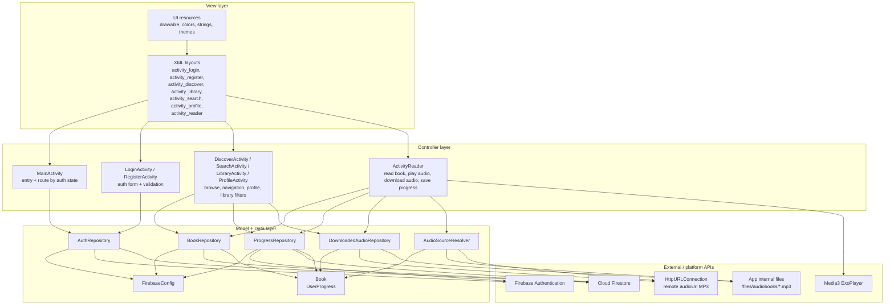
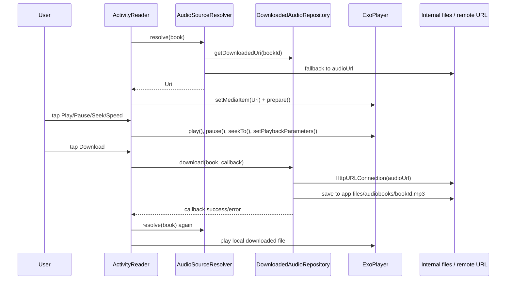

# MVC Architecture Diagram - Fonos_Group13

Project hien tai theo kieu MVC gan dung cho Android Java:

- Model: `model/*` va `data/*`, gom entity/domain object, repository, Firebase, file download.
- View: `res/layout*/*`, drawable, string/resource UI.
- Controller: cac `Activity`, vi Activity bind view, bat su kien, dieu huong, goi repository va cap nhat UI.

## Audio download and playback flow

## Activities

| Activity | Vai tro |
|---|---|
| `MainActivity` | Launcher entry; kiem tra user da dang nhap chua, sau do dieu huong sang `LoginActivity` hoac `DiscoverActivity`. |
| `LoginActivity` | Man hinh dang nhap, validate email/password, goi `AuthRepository.signIn`. |
| `RegisterActivity` | Man hinh tao tai khoan, validate form, goi `AuthRepository.register`. |
| `DiscoverActivity` | Trang kham pha sach/audio book, load danh sach tu `BookRepository`, mo `ActivityReader` khi chon sach. |
| `SearchActivity` | Man hinh search/navigation; hien tai chu yeu set layout va bottom navigation. |
| `LibraryActivity` | Thu vien: filter Listening/Downloaded/Finished, lay progress, kiem tra audio da download. |
| `ProfileActivity` | Hien thi thong tin Firebase user va dang xuat. |
| `ActivityReader` | Man doc/nghe sach: hien noi dung, play/pause/seek/speed, download audio, restore/save progress. |

## Services, receiver, provider

| Component | Co trong project? | Ghi chu |
|---|---:|---|
| Android `Service` | Khong | Manifest khong khai bao `<service>` va source khong co class `extends Service`. |
| Foreground/music playback service | Khong | Audio duoc phat bang `ExoPlayer` truc tiep trong `ActivityReader`, nen nhac khong chay qua `MediaSessionService`/foreground service rieng. |
| Download service / `DownloadManager` | Khong | Download MP3 duoc tu code trong `DownloadedAudioRepository`: tao `new Thread`, dung `HttpURLConnection`, luu vao internal files. |
| `BroadcastReceiver` | Khong | Manifest khong co `<receiver>`, source khong co `BroadcastReceiver`, `registerReceiver`, `sendBroadcast`. |
| `ContentProvider` | Khong | Manifest khong co `<provider>`, source khong co class `ContentProvider`. Neu y ban la "broadcast provider" thi Android khong co component ten nay; component tuong ung thuong la `ContentProvider`. |

## External services/libraries actually used

- Firebase Authentication: dang nhap, dang ky, lay current user, dang xuat.
- Cloud Firestore: `books`, `users`, `users/{uid}/progress`.
- Media3 ExoPlayer: phat audio trong `ActivityReader`.
- `HttpURLConnection`: tai file MP3 tu `audioUrl`.
- Internal app storage: luu file download o `files/audiobooks/*.mp3`.
